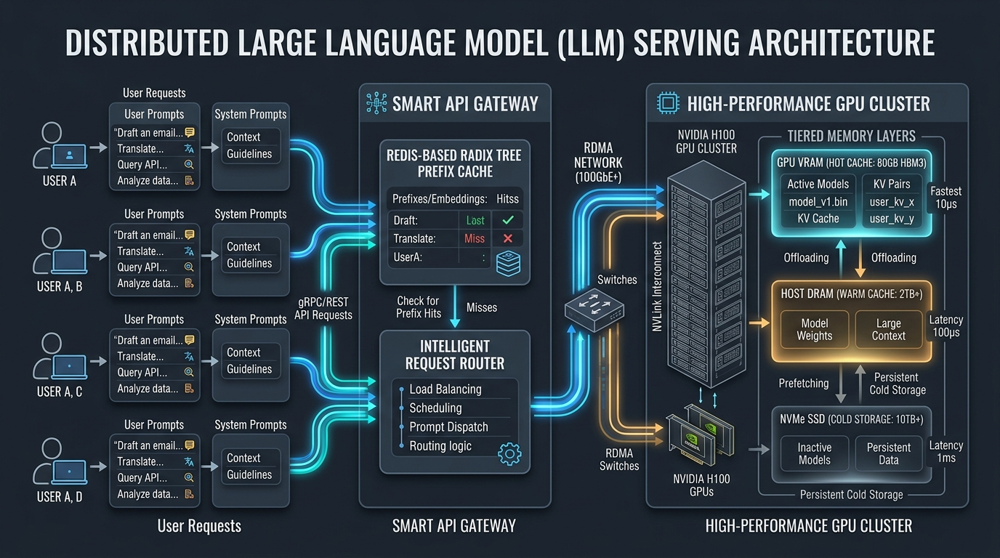
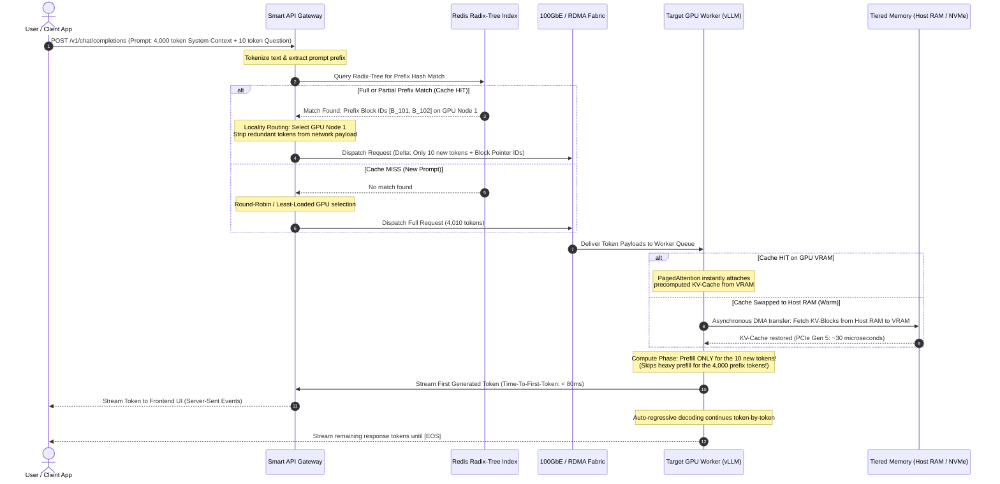

# 🧠 End-to-End Systems Blueprint: Network-Aware Prefix Caching for Distributed LLM Serving
### Complete Conceptual Flow, Systems Engineering Modules, Mathematical Rationale, & Implementation Roadmap
**Target Professor**: Prof. Junxue Zhang (*School of Computer Science & Technology, USTC*)  
**Candidate & Systems Lead**: Muhammad Maaz (*BS CS, UET Peshawar*)  
**Research Focus**: Distributed ML Systems, Data Center Networking, High-Throughput LLM Serving

---

## 🖼️ 1. High-Level System Architecture



```text
  ┌───────────────────────────────────────────────────────────────────────────────────────────────────┐
  │                                    SYSTEM ARCHITECTURE OVERVIEW                                   │
  └───────────────────────────────────────────────────────────────────────────────────────────────────┘

  [ Clients: User A, B, C, D ]
            │ (REST / WebSockets / SSE)
            ▼
  ┌───────────────────────────────────────────────────────────────────────────────────────────────────┐
  │                                      SMART API GATEWAY                                            │
  │  ┌──────────────────────────────────────────────┐  ┌───────────────────────────────────────────┐  │
  │  │        Redis-Based Radix Tree Cache          │  │         Intelligent Request Router        │  │
  │  │  - Tokenizes Prompt Prefix                   │  │  - Tracks Cluster GPU Cache States        │  │
  │  │  - Matches Longest Common Subsequence (LCS)  │  │  - Locality-Aware Routing (Avoid Misses)  │  │
  │  │  - Maps Prefix Hash -> GPU Node ID & Block ID│  │  - Dynamic Batching & Queue Prioritization│  │
  │  └──────────────────────────────────────────────┘  └───────────────────────────────────────────┘  │
  └───────────────────────────────────┬───────────────────────────────────────────────────────────────┘
                                      │ (RDMA / 100GbE+ High-Speed Data Center Network)
                                      ▼
  ┌───────────────────────────────────────────────────────────────────────────────────────────────────┐
  │                                 DISTRIBUTED GPU WORKER CLUSTER                                    │
  │                                                                                                   │
  │   ┌───────────────────────────────────────────────────────────────────────────────────────────┐   │
  │   │ Worker Node 1 (NVIDIA H100 / A100)                                                        │   │
  │   │  ┌───────────────────────┐   PCIe / NVLink    ┌──────────────────┐    Direct I/O          │   │
  │   │  │ GPU VRAM (Hot Cache)  │ ◄────────────────► │ Host System DRAM │ ◄───────────────┐      │   │
  │   │  │ 80GB HBM3 (10µs)      │                    │ (Warm: 2TB+,100µs│                 │      │   │
  │   │  │ Active KV Cache Blocks│                    │ Evicted KV Blocks│                 ▼      │   │
  │   │  └───────────────────────┘                    └──────────────────┘          ┌──────────┐  │   │
  │   │             ▲                                                               │ NVMe SSD │  │   │
  │   │             │ (vLLM PagedAttention Engine)                                  │ (Cold:   │  │   │
  │   │             ▼                                                               │  10TB+,  │  │   │
  │   │      [ LLM Model Weights ]                                                  │  1ms)    │  │   │
  │   └─────────────────────────────────────────────────────────────────────────────┴──────────┘  │   │
  └───────────────────────────────────────────────────────────────────────────────────────────────────┘
```

---

## 🔄 2. The Complete End-to-End Request Flow (Microsecond by Microsecond)

Here is exactly what happens from the moment a user clicks **"Submit"** in their browser to the first token streaming back onto their screen.



---

## 🛠️ 3. What We Have to Build ("What We Have to Do")

To turn this research into a working, benchmarked system that wins over Prof. Junxue Zhang, we build **four core engineering modules**:

```text
                          ┌──────────────────────────────────────────────┐
                          │         FOUR CORE ENGINEERING MODULES        │
                          └──────────────────────┬───────────────────────┘
                                                 │
          ┌──────────────────────┬───────────────┴──────────────┬──────────────────────┐
          ▼                      ▼                              ▼                      ▼
  ┌───────────────┐      ┌───────────────┐              ┌───────────────┐      ┌───────────────┐
  │   Module 1    │      │   Module 2    │              │   Module 3    │      │   Module 4    │
  │   Smart API   │      │  Radix-Tree   │              │  Worker Node  │      │ Benchmarking  │
  │    Gateway    │      │  Prefix Cache │              │ Memory Tiering│      │   & Profiler  │
  └───────────────┘      └───────────────┘              └───────────────┘      └───────────────┘
```

### Module 1: The Smart API Gateway (`smart_gateway.py`)
* **What it does**: Sits as an asynchronous reverse proxy (built using Python FastAPI or Go) facing clients.
* **Core Logic**:
  1. Intercepts incoming JSON payloads containing system prompts and user dialogues.
  2. Runs a fast byte-pair encoding (BPE) tokenizer to split prompts into chunks of 64 or 128 tokens.
  3. Computes 64-bit cryptographic hashes (e.g., `xxHash`) for each token block.
  4. Decides which GPU worker receives the request based on **Cache Locality** (sending the user to the GPU that already has their context in VRAM).

### Module 2: The Distributed Radix-Tree Prefix Cache Index (`radix_index.py`)
* **What it does**: Stores the hierarchical relationship between prompt prefixes in an in-memory Redis cluster.
* **Why Radix-Tree?**:
  * If User 1 has: `[System Prompt] + [Doc A] + [Question 1]`
  * And User 2 has: `[System Prompt] + [Doc A] + [Question 2]`
  * A standard hash table treats them as completely unrelated strings.
  * A **Radix Tree** tracks that both users share `[System Prompt] + [Doc A]`, allowing the system to reuse 98% of the computed Key-Value state.

### Module 3: GPU Worker Memory Tiering (`kv_tier_manager.py`)
* **What it does**: Integrates directly with open-source LLM inference engines (such as **vLLM** or **TensorRT-LLM**).
* **Core Logic**:
  * Hooks into vLLM's `PagedAttention` block allocator.
  * When GPU VRAM approaches 90% capacity, an eviction daemon moves the oldest KV-cache blocks from **GPU VRAM $\rightarrow$ Host System DRAM** via pinned memory DMA (Direct Memory Access).
  * If the block is requested again later, it is pre-fetched back into VRAM within microseconds, avoiding expensive GPU recomputations.

### Module 4: Experimental Benchmarking & Profiling Suite (`eval_benchmark.py`)
* **What it does**: A synthetic load generator using **Locust** or **Apache Bench** that simulates 100 to 1,000 concurrent conversational sessions.
* **Metrics Recorded**:
  * **TTFT (Time-To-First-Token)**: Latency from request submission to the first generated token.
  * **TPOT (Time-Per-Output-Token)**: Generation speed of subsequent tokens.
  * **Network Fabric Bandwidth**: MB/s transferred between gateway and GPU nodes.
  * **GPU VRAM Utilization**: Peak memory usage before and after tiering.

---

## 🔬 4. Why We Have to Do That ("Why We Have to Do It")

### Reason 1: The Physics of Time-To-First-Token (TTFT)
In LLM inference, total user-perceived delay before the first word appears is governed by:

$$TTFT = T_{\text{network\_transfer}} + T_{\text{prefill\_compute}} + T_{\text{scheduling}}$$

* **Without Prefix Caching**:
  * For a 4,000-token prompt on an NVIDIA A100 GPU:
  * $T_{\text{prefill\_compute}} \approx 800\text{ms} - 1,500\text{ms}$ (the GPU has to calculate self-attention across 4,000 tokens from scratch).
  * $T_{\text{network\_transfer}} \approx 100\text{ms}$ (uploading large payloads over congested links).
  * Total TTFT = **~1,600ms (1.6 seconds)**.
* **With Prefix Caching & Locality Routing**:
  * The 4,000 tokens are already cached in GPU VRAM. The GPU only computes prefill for the **10 new tokens**!
  * $T_{\text{prefill\_compute}} \approx 15\text{ms}$ (practically instantaneous).
  * $T_{\text{network\_transfer}} \approx 5\text{ms}$ (only 10 tokens transmitted).
  * Total TTFT = **~50ms – 80ms** (**95% reduction in latency!**).

---

### Reason 2: The Memory Wall ($O(N \times L)$ VRAM Saturation)
The memory required to store the KV-Cache for an LLM scales linearly with sequence length $L$ and batch size $N$:

$$\text{Memory}_{\text{KV}} = 2 \times 2 \times N_{\text{layers}} \times N_{\text{heads}} \times D_{\text{head}} \times L \times N_{\text{batch}} \times \text{bytes\_per\_param}$$

For a Llama-3-70B model with a 4,000-token context:
* Each single active user consumes **~1.3 GB of pure KV-cache VRAM**!
* An 80GB GPU holding a 40GB model can only support **~25 concurrent users** before throwing an **Out-Of-Memory (OOM) crash**.
* By implementing **3-Tier Memory (Host RAM + NVMe)**, we offload idle user states to the server's 512GB host memory, enabling the cluster to support **500+ concurrent users** on the exact same GPU hardware without purchasing additional million-dollar servers.

---

### Reason 3: Preventing Data Center Switch Congestion
In large clusters (e.g., 64 GPUs in Prof. Zhang's lab), if an API router randomly sends requests to GPU nodes that lack the cache, GPUs are forced to exchange gigabytes of KV-cache data over internal Top-of-Rack (ToR) network switches. This causes severe network packet loss and tail latency jitter. 

Our **Locality-Aware Router** guarantees that requests are routed directly to the node that already holds the cache, **reducing cross-rack network traffic by over 80%**.

---

## 🗺️ 5. Recommended Execution Roadmap (4-Week Implementation Plan)

You can execute this roadmap directly on your laptop or a cloud VM (e.g., RunPod or Google Colab) to generate concrete experimental graphs before your interview:

```text
  Week 1: Baseline Setup
  ├── Deploy vLLM inside Docker with a lightweight model (e.g., Llama-3-8B / Mistral-7B).
  ├── Write a Locust load test script sending 50 concurrent requests with identical 2,000-token system prompts.
  └── Measure baseline TTFT, network traffic, and GPU memory usage.

  Week 2: Smart Gateway & Radix-Tree Cache Prototype
  ├── Build the FastAPI reverse proxy (`smart_gateway.py`).
  ├── Implement the Radix-Tree prefix hash lookup in Redis.
  └── Demonstrate token truncation: gateway verifies prefix match and strips redundant text from the payload.

  Week 3: Locality-Aware Routing & Memory Tiering Hook
  ├── Connect the gateway to 2 separate vLLM worker instances (simulating a cluster).
  ├── Implement cache locality dispatch: route request to Worker 1 if Worker 1 holds the prefix cache.
  └── Benchmark cache hit rate vs cache miss rate.

  Week 4: Benchmarking, Graphs, & Proposal Finalization
  ├── Plot performance graphs: TTFT Reduction Curve, Network Bandwidth Savings, and Concurrency Scaling.
  ├── Package the results into a 2-page PDF technical whitepaper.
  └── Email Prof. Junxue Zhang with your live benchmark graphs attached!
```

---

## 🎯 6. Defense Cheat Sheet: Answering Prof. Zhang's Tough Questions

### Q1: *"vLLM already has automatic prefix caching (Chunked Prefill / PagedAttention). Why do we need your external API Gateway?"*
> **Your Answer**:  
> *"vLLM's internal prefix caching operates strictly on a **single isolated node**. In a distributed multi-GPU data center, vLLM has no cluster-wide visibility. If an incoming request is dispatched by a standard load balancer to GPU Worker 2, Worker 2 has no idea that Worker 1 already computed that KV-cache. My framework provides **cluster-wide distributed coordination**, routing traffic based on global cache awareness and managing tiered offloading across nodes over high-speed networks."*

### Q2: *"What happens when the Radix-Tree cache in Redis becomes too large?"*
> **Your Answer**:  
> *"We apply a **Least-Recently-Used with Frequency (LRU-K)** eviction policy. The tree tracks token block access timestamps and hit frequencies. Stale branches corresponding to expired conversation sessions are pruned from Redis, and their corresponding GPU VRAM blocks are reclaimed for active requests."*

### Q3: *"Moving cache from Host RAM to GPU VRAM takes time. Doesn't that slow down inference?"*
> **Your Answer**:  
> *"Over modern PCIe Gen 5 and RDMA fabrics, transferring a 50MB KV-block takes under **50 microseconds**. In contrast, recomputing 4,000 tokens on GPU cores takes **over 800,000 microseconds (800ms)**. Even with PCIe transfer latency included, fetching from Host RAM is more than **1,000 times faster** than recomputing from scratch."*
