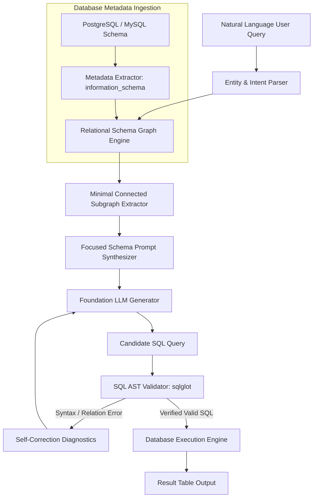

# 🎓 Master Graduate Application Dossier: USTC & UCAS (2026/2027)
### Candidate: Muhammad Maaz Khan | Discipline: MS in Computer Science
**Target Universities**: University of Science and Technology of China (USTC) & University of Chinese Academy of Sciences (UCAS)  
**Target Scholarships**: CAS-ANSO Scholarship for Young Talents / Chinese Government Scholarship (CSC Type B)  
**Core Project**: *Relational Graph-RAG for Text-to-SQL over Complex Database Schemas*  
**Target Faculty Mentor**: Prof. Huanhuan Chen (*School of Computer Science & Technology, USTC*)

---

## 📑 Table of Contents
- [PART A: Research Topic Assessment](#part-a-research-topic-assessment)
- [PART B: Potential Research Gap & Literature Boundary](#part-b-potential-research-gap--literature-boundary)
- [PART C: USTC Master's Research & Study Proposal (1,000+ Words)](#part-c-ustc-masters-research--study-proposal)
- [PART D: UCAS Master's Motivation Letter & Study Plan](#part-d-ucas-masters-motivation-letter--study-plan)
- [PART E: CAS-ANSO / CSC Scholarship Research Statement](#part-e-cas-anso--csc-scholarship-research-statement)
- [PART F: Professor-Specific Research Proposal Attachment (2–4 Page PDF Layout)](#part-f-professor-specific-research-proposal-attachment)
- [PART G: Concise Professor Outreach Email (250–350 Words)](#part-g-concise-professor-outreach-email)
- [PART H: 24-Month Master's Research & Academic Roadmap](#part-h-24-month-masters-research--academic-roadmap)
- [PART I: Official Application Document Preparation Checklist](#part-i-official-application-document-preparation-checklist)
- [PART J: Critical Application Weaknesses & Honest Mitigation Plan](#part-j-critical-application-weaknesses--honest-mitigation-plan)

---

# PART A: Research Topic Assessment

### Proposed Topic:
> *"Relational Graph-RAG for Text-to-SQL over Complex Database Schemas"*

### Feasibility & Scope Evaluation for an MS Degree:
1. **Academic Relevance**:  
   Text-to-SQL has shifted from basic single-table translation to enterprise-scale reasoning over heterogeneous relational databases. Standard Retrieval-Augmented Generation (RAG) models databases as collections of text strings, ignoring relational calculus and structural dependencies. Bridging graph theory with relational schema linking represents an active, valid research direction within database intelligence and knowledge engineering.
2. **Scope for a 2-Year Master's Thesis**:  
   The project is focused. It does not attempt to train a foundation language model from scratch. Instead, it investigates a schema-linking and retrieval framework using existing open-weight models (e.g., CodeLlama, DeepSeek-Coder, or Qwen) alongside directed graph representations of relational schemas. This makes the project feasible within the computational and time constraints of a two-year master's program.
3. **Alignment with Candidate's Background**:  
   Muhammad Maaz Khan has spent 4+ years engineering production database systems (PostgreSQL, MySQL, Prisma, Redis) and backend APIs. While he is transitioning to research and must learn academic Python and formal ML methodologies during his master's coursework, his daily practical familiarity with relational schemas, foreign-key indexing, and data constraints provides a solid engineering foundation.
4. **Alignment with Target Faculty**:  
   Prof. Huanhuan Chen's official research profile at USTC centers on Machine Learning, Data Mining, and Big Knowledge Engineering. While Prof. Chen does not run a dedicated "Text-to-SQL" lab, his extensive scholarship in knowledge representation, graph neural frameworks, and data mining provides an appropriate academic environment for studying relational knowledge graphs.

---

# PART B: Potential Research Gap & Literature Boundary

> **Academic Disclaimer**: *The boundaries described below represent a potential research gap identified from current open literature and require further empirical validation through systematic literature reviews during Year 1 coursework.*

### 1. Existing Work & Current Baseline Approaches
* **Direct Prompting**: Providing raw DDL (Data Definition Language) schema dumps inside the LLM prompt window (e.g., standard Spider / BIRD benchmark baselines).
* **Vector-Based Schema Retrieval (Standard RAG)**: Converting table and column descriptions into vector embeddings and performing top-$k$ cosine similarity retrieval against natural language query tokens.
* **Specialized Text-to-SQL Models**: Fine-tuned architectures (e.g., RESDSQL, DAIL-SQL) that perform lexical and syntactic schema linking.

### 2. The Identified Limitation (Potential Research Gap)
* **Relational Disconnection in Large-Scale Schemas**: When databases scale to 50–200+ tables, vector retrieval retrieves tables with high semantic lexical overlap to the query, but systematically omits **intermediate junction tables** necessary to satisfy foreign-key join paths.
* **Absence of Relational Constraint Enforcement**: Existing open-source retrieval systems treat database metadata as unstructured text documents rather than constrained relational graphs, resulting in syntactically invalid `JOIN` predictions on multi-hop queries.

### 3. Proposed Research Boundary
Investigating whether transforming relational metadata (primary keys, foreign keys, and referential constraints) into an explicit, directed Schema Graph and applying graph-traversal algorithms before prompt synthesis yields statistically significant improvements in **Execution Accuracy (EX)** and **Schema-Linking Recall (SL)** compared to standard vector retrieval baselines on multi-table benchmarks (e.g., BIRD-SQL, Spider).

---

# PART C: USTC Master's Research & Study Proposal

```text
Title: Relational Graph-Aware Schema Retrieval for Robust Text-to-SQL Translation over Enterprise Databases
Degree Program: Master of Science (MS) in Computer Science and Technology
Host Institution: School of Computer Science and Technology, University of Science and Technology of China (USTC)
Proposed Academic Mentor: Prof. Huanhuan Chen
```

### 1. Introduction & Research Problem
Natural Language Interfaces to Databases (NLIDB) aim to democratize data analytics by translating natural language questions directly into executable SQL queries. Despite recent advances in Large Language Models (LLMs), generating correct SQL over complex, multi-table enterprise schemas remains an open challenge. 

In realistic enterprise environments (e.g., ERP and CRM databases), schemas comprise hundreds of tables interconnected by complex referential integrity constraints. When a user question requires aggregating data across multiple entities (e.g., calculating sales across product categories for specific user departments), the generating model must identify not only the terminal tables containing the requested metrics, but also all intermediate relational bridges. Current LLM pipelines either flood the prompt context with entire schema dumps—incurring significant token costs and attention degradation—or rely on naive vector similarity search, which frequently omits essential intermediate tables.

This proposed research seeks to formulate, implement, and evaluate **Relational Graph-RAG**, a framework that models database metadata as a directed relational knowledge graph. By executing structural path searches across foreign-key dependencies, the system isolates the minimal connected subgraph required to answer a query, providing the LLM with structurally sound, hallucination-resistant relational context.

### 2. Academic Background & Preparation
I hold a Bachelor of Science in Computer Science from the University of Engineering and Technology (UET), Peshawar, Pakistan. Over the past 4+ years, I have worked professionally as a software engineer architecting backend infrastructure, RESTful/GraphQL APIs, relational database schemas (PostgreSQL, MySQL), and caching pipelines (Redis).

Through this industry experience, I developed a rigorous understanding of relational algebra, foreign-key indexing, schema normalization, and containerized deployment (Docker). However, I recognize that commercial engineering differs fundamentally from academic inquiry. I do not claim prior academic publications or advanced machine learning research expertise. My practical mastery of relational databases serves as an applied foundation; my objective at USTC is to acquire the formal theoretical training in statistical learning, knowledge representation, and scientific experimentation required to conduct rigorous Computer Science research.

### 3. Research Objectives
1. **Schema-to-Graph Formalization**: Design an automated parser that extracts PostgreSQL and MySQL metadata (`information_schema`) and constructs a directed Relational Schema Graph encoding tables, columns, data types, and primary/foreign-key constraints.
2. **Multi-Hop Subgraph Retrieval**: Formulate a path-traversal algorithm that links natural language query entities to graph nodes and extracts the minimal connected subgraph necessary to bridge all referenced tables.
3. **AST-Guided Query Validation**: Implement a post-generation verification loop using Abstract Syntax Tree (AST) parsing to evaluate candidate queries against foreign-key integrity constraints prior to execution.
4. **Empirical Benchmarking**: Conduct controlled comparative experiments against standard schema-prompting and vector-RAG baselines on standardized multi-table benchmarks (BIRD, Spider), measuring Execution Accuracy, Schema-Linking Recall, latency, and token efficiency.

### 4. Proposed Methodology
The proposed research will follow a structured four-stage methodology:



* **Phase I: Metadata Extraction & Graph Construction**:  
  Develop an automated extraction daemon that parses relational schemas into an in-memory graph representation using NetworkX. Graph vertices represent tables and attribute fields; directed edges represent referential constraints and cardinality.
* **Phase II: Subgraph Extraction Algorithm**:  
  Implement a graph search mechanism (evaluating bidirectional BFS, Dijkstra's shortest path, and Steiner tree heuristics) to discover valid multi-table join paths between entities identified in the natural language query.
* **Phase III: Prompt Optimization & Validation Loop**:  
  Format the extracted subgraph into concise schema definitions. The candidate SQL emitted by the LLM will be evaluated by an AST parser (`sqlglot`) to verify that all joined tables exist along valid foreign-key edges before database execution.
* **Phase IV: Controlled Experimentation**:  
  Evaluate the framework against established baselines across varying schema complexities (10 to 100+ tables).

### 5. Why the University of Science and Technology of China (USTC)?
USTC is globally recognized for its uncompromising research rigor and leadership in Computer Science and Technology. The School of Computer Science and Technology offers the exact theoretical curriculum—particularly in Advanced Database Systems, Machine Learning, and Knowledge Engineering—that I need to complete my transition from engineering to research. 

Furthermore, the work of **Prof. Huanhuan Chen** in Big Knowledge Engineering, Data Mining, and Machine Learning aligns directly with my aspiration to study knowledge representations over structured enterprise data. Under his guidance, I hope to anchor this practical database problem within formal knowledge engineering principles.

---

# PART D: UCAS Master's Motivation Letter & Study Plan

```text
Title: Motivation Letter and Academic Study Plan
Applicant: Muhammad Maaz Khan
Degree: Master of Science in Computer Science
Institution: University of Chinese Academy of Sciences (UCAS) / CAS Institute of Software (ISCAS)
```

### 1. Purpose of Studying in China
China has emerged as a preeminent global leader in computer systems research, artificial intelligence infrastructure, and advanced data engineering. The University of Chinese Academy of Sciences (UCAS), uniquely integrated with the research institutes of the Chinese Academy of Sciences (CAS), provides an unmatched research-first ecosystem where graduate students participate directly in national-level scientific inquiries. Studying in China offers me the opportunity to immerse myself in an intensive academic environment that values both theoretical depth and large-scale practical deployment.

### 2. Academic Background & Professional Experience
I graduated with a Bachelor's degree in Computer Science from the University of Engineering and Technology (UET), Peshawar, Pakistan. Over the past 4+ years, I have worked as a full-stack and backend software engineer, architecting web systems, relational databases (PostgreSQL, MySQL), real-time communication protocols (WebSockets), and containerized microservices (Docker). 

While my professional trajectory provided strong engineering discipline and system debugging skills, it also revealed to me the limitations of heuristic software development. Real-world applications increasingly require intelligent data interfaces capable of automated reasoning over complex data. To contribute meaningfully to this field, I need to formalize my understanding through rigorous graduate research.

### 3. Reasons for Applying to UCAS
UCAS offers a distinctive educational model: comprehensive theoretical coursework during the first academic year at the university campus, followed by dedicated, full-time laboratory research at a specialized CAS research institute (such as the Institute of Software, ISCAS, or the Institute of Computing Technology, ICT). 

This integration of coursework with institute-level laboratory research is ideal for my goals. At UCAS, I will have access to high-performance computing testbeds, advanced seminars, and mentorship from researchers who operate at the forefront of software engineering and intelligent computing.

### 4. Proposed Study & Research Plan
* **Year 1 (Foundational Coursework & Research Preparation)**:  
  * Master core graduate courses: Advanced Algorithms, Machine Learning Foundations, Mathematical Statistics, and Knowledge Engineering.
  * Bridge technical competencies: Complete intensive training in academic Python, PyTorch, and empirical experimental design, transitioning from TypeScript/Node.js to scientific research tools.
  * Conduct a systematic literature review on relational schema linking and Text-to-SQL benchmarks under the guidance of my supervisor.
* **Year 2 (Thesis Investigation & Evaluation)**:  
  * Formalize the Relational Graph-RAG architecture for schema-constrained database query generation.
  * Deploy experimental benchmarks against established public datasets (Spider, BIRD) on CAS laboratory servers.
  * Conduct ablation studies evaluating execution accuracy, token efficiency, and schema complexity scaling.
  * Compile the Master's thesis and submit research findings to peer-reviewed academic conferences or journals if results meet scientific standards.

### 5. Career Goals
Following the completion of my Master's degree at UCAS, my goal is to continue working in advanced computer science research, either by pursuing a Ph.D. program in intelligent systems or by joining an advanced R&D laboratory specializing in database intelligence and AI infrastructure. The rigorous training at UCAS will equip me with the analytical mindset, statistical foundation, and experimental rigor necessary to contribute meaningfully to next-generation software systems.

---

# PART E: CAS-ANSO / CSC Scholarship Research Statement

```text
Scholarship Application Statement: Alliance of International Science Organizations (CAS-ANSO) / CSC
Applicant: Muhammad Maaz Khan (Pakistan)
Field of Study: Computer Science and Technology (Master of Science)
```

### 1. Statement of Academic Purpose & Research Motivation
Access to data remains one of the greatest operational barriers across scientific, industrial, and public domains. Non-technical domain experts (healthcare workers, researchers, business analysts) struggle to extract insights from relational databases due to the steep learning curve of SQL and complex schema designs. 

My research proposal—*Relational Graph-Aware Retrieval for Enterprise Text-to-SQL*—aims to address this challenge by developing structurally verified natural language interfaces to relational databases. By converting complex schemas into directed relational graphs and leveraging graph-traversal algorithms, this research seeks to eliminate hallucinations and generate mathematically correct SQL queries over enterprise-scale databases.

### 2. Academic Preparation & Practical Foundation
My academic background at UET Peshawar provided me with foundational training in Computer Science, which I supplemented with 4+ years of professional backend software engineering. I have designed relational schemas, optimized multi-table SQL queries, managed distributed caching layers (Redis), and deployed microservices in Docker environments. 

I recognize that commercial software engineering is not equivalent to academic research. However, my deep practical familiarity with how databases function in production enables me to understand the engineering reality behind theoretical research questions. Supported by this scholarship, I will dedicate myself full-time to mastering statistical learning, machine learning algorithms, and research methodologies.

### 3. Why Scholarship Support is Essential
Pursuing rigorous graduate research in Computer Science requires undivided focus and access to institutional computational resources. The CAS-ANSO Scholarship / Chinese Government Scholarship would relieve financial burdens, enabling me to devote 100% of my time to academic coursework, laboratory experimentation, and thesis writing at USTC/UCAS. 

Furthermore, the ANSO network promotes scientific collaboration between China and developing countries. As a Pakistani graduate, completing an advanced research degree in China will allow me to foster academic and technological ties between our scientific communities, contributing to shared advancements in computer systems and data engineering.

---

# PART F: Professor-Specific Research Proposal Attachment

```text
================================================================================
PRELIMINARY RESEARCH PROPOSAL (MASTER'S THESIS APPLICANT)
Relational Graph-Aware Schema Retrieval for Robust Text-to-SQL over Complex Databases
================================================================================

Applicant: Muhammad Maaz Khan
Degree Objective: Master of Science in Computer Science and Technology
Target University: University of Science and Technology of China (USTC)
Proposed Host Laboratory: Laboratory of Prof. Huanhuan Chen
```

### 1. Abstract
Translating natural language questions into structured SQL queries (Text-to-SQL) over complex relational databases is constrained by the challenge of schema linking. Existing Retrieval-Augmented Generation (RAG) frameworks treat database schemas as unstructured collections of text, retrieving tables via semantic vector similarity. Over large-scale enterprise schemas comprising dozens of tables, vector retrieval frequently fails to retrieve intermediate junction tables necessary to satisfy multi-hop foreign-key joins, resulting in execution failures. This proposal presents **Relational Graph-RAG**, a framework that models database metadata as a directed relational knowledge graph. By executing structural path searches across foreign-key dependencies, the system extracts the minimal connected subgraph required to bridge user entities, supplying the language model with structurally verified relational context. The proposed methodology will be evaluated against standard schema prompting and vector-RAG baselines on public benchmarks (Spider, BIRD), measuring execution accuracy, schema-linking recall, latency, and token efficiency.

### 2. Research Background & Problem Statement
Enterprise databases rely on referential integrity constraints (primary and foreign keys) to normalize data across hundreds of interconnected tables. While Large Language Models exhibit high proficiency on single-table queries, multi-table queries that span three or more relational hops frequently trigger two major failure modes:
1. **Schema Hallucination**: The model assumes columns exist in incorrect tables or invents non-existent relational links.
2. **Disconnected Join Paths**: When vector retrieval identifies terminal tables (e.g., `departments` and `products`) but omits intermediate bridging tables (e.g., `users`, `orders`), the model cannot construct mathematically valid SQL joins.

### 3. Literature Summary & Identified Gap
Recent state-of-the-art approaches (such as DAIL-SQL, RESDSQL, and standard RAG pipelines) have investigated various schema serialization and in-context selection methods. However, most open retrieval pipelines model schema components independently:
* *Textual Schema Representation*: Formats tables into DDL strings, which rapidly exceed context limits or dilute model attention.
* *Vector Embedding Retrieval*: Evaluates semantic similarity between query tokens and table/column names, which inherently lacks awareness of relational topology and foreign-key constraints.

**Potential Research Gap**: There is an opportunity to investigate whether explicit, graph-theoretic schema modeling—wherein foreign keys serve as directed edges and graph-search algorithms extract connected subgraphs prior to generation—can systematically eliminate disconnected join paths in multi-table Text-to-SQL tasks.

### 4. Research Objectives & Questions
* **Objective 1**: Develop an automated schema parser that compiles relational database metadata (`information_schema`) into a directed relational knowledge graph.
* **Objective 2**: Design an entity-to-node mapping and path-search algorithm to extract minimal connected subgraphs for natural language queries.
* **Objective 3**: Implement an AST-based SQL verification loop to validate foreign-key constraints prior to database execution.
* **Objective 4**: Empirically evaluate the proposed framework against baseline methods on the Spider and BIRD benchmarks.

* **Research Questions**:
  * *RQ1*: Does relational-graph-aware schema retrieval significantly improve Execution Accuracy (EX) over complex multi-table queries compared to standard vector retrieval?
  * *RQ2*: By what factor does subgraph context pruning reduce token consumption compared to full schema prompting?
  * *RQ3*: How effectively does an AST-guided verification loop detect and repair relational join errors prior to execution?

### 5. Methodology & System Architecture

```text
  [ User Query ] ──► [ Entity Linking ] ──► [ Relational Schema Graph ]
                                                        │
                                                        ▼
  [ LLM Generator ] ◄── [ Connected Subgraph Context ] ◄── [ Multi-Hop Path Search ]
         │
         ▼
  [ Candidate SQL ] ──► [ SQL AST Validator ] ──► [ Validated SQL ] ──► [ PostgreSQL Execution ]
                               │
                               ▼ (If Invalid)
                    [ Diagnostics / Self-Repair ] ──► (Feedback to LLM)
```

1. **Schema Graph Construction**: Inspect PostgreSQL metadata tables (`table_constraints`, `key_column_usage`) to populate a directed graph $G = (V, E)$, where $V$ represents tables and columns, and $E$ represents primary-foreign key relationships.
2. **Path Discovery**: Map extracted query entities to graph nodes. Execute shortest-path and Steiner tree heuristics to identify the minimal connected subgraph bridging all required tables.
3. **Prompt Synthesis & Verification**: Feed only the connected schema subgraph to the language model. Parse generated SQL via `sqlglot` to verify that all `JOIN` conditions conform to actual graph edges.

### 6. Experimental Design & Metrics
* **Datasets**: Spider benchmark (cross-domain multi-table) and BIRD benchmark (large-scale real-world database benchmark).
* **Baselines**:
  * Baseline A: Direct LLM generation with complete raw schema dump.
  * Baseline B: Standard Vector RAG using dense embedding similarity.
* **Metrics**:
  * Execution Accuracy (EX %): Ground-truth tabular result equivalence.
  * Schema-Linking Recall (SL %): Proportion of required ground-truth tables/columns retrieved.
  * Token Efficiency: Prompt token consumption per query.
  * End-to-End Latency: Total processing time in seconds.

### 7. Candidate Background & Feasibility
I hold a BS in Computer Science from UET Peshawar with 4+ years of professional backend software engineering experience. My daily work with PostgreSQL, MySQL, Redis, Docker, and REST APIs provides the practical systems foundation required to build database extractors, caching layers, and evaluation pipelines. While I have not published academic papers, I am committed to dedicating my first academic year to mastering theoretical machine learning, research methodologies, and academic writing.

### 8. Fit with Prof. Huanhuan Chen's Laboratory
Prof. Huanhuan Chen’s research in Machine Learning, Data Mining, and Big Knowledge Engineering provides the ideal theoretical framework for this work. Structuring enterprise relational schemas as knowledge graphs aligns directly with knowledge engineering principles. Under Prof. Chen's supervision, I hope to translate practical database engineering challenges into rigorous academic contributions.

---

# PART G: Concise Professor Outreach Email

```text
Subject: Prospective MS Student (Fall 2026) – Research Inquiry in Database Knowledge Engineering

Dear Prof. Chen,

I hope this email finds you well.

My name is Muhammad Maaz Khan, and I hold a Bachelor of Science in Computer Science from the University of Engineering and Technology (UET), Peshawar, Pakistan. Over the past four years, I have worked professionally as a software engineer specializing in backend systems, relational database architecture (PostgreSQL, MySQL), and distributed caching (Redis).

I have been studying your research in Machine Learning, Data Mining, and Big Knowledge Engineering at USTC with great interest. I am particularly drawn to the challenge of bridging structured knowledge representations with neural models to solve complex systems problems.

Drawing on my background in relational database architectures, I am developing a Master's research proposal focused on "Relational Graph-Aware Schema Retrieval for Robust Text-to-SQL Translation." While conventional RAG methods treat database schemas as unstructured text, enterprise databases require navigating multi-hop foreign-key relationships across dozens of tables. I am investigating whether modeling database schemas as directed relational knowledge graphs can systematically eliminate disconnected join paths and improve execution accuracy on complex queries.

I am preparing my application for the CAS-ANSO Scholarship for Young Talents for the upcoming graduate intake at USTC, and I am writing to inquire whether you might have prospective Master's student openings in your research group. 

I understand that commercial engineering differs from academic research; I am committed to undertaking rigorous graduate training in theoretical machine learning and research methodologies under your supervision.

Attached to this email, please find:
1. My Curriculum Vitae (highlighting systems and database experience)
2. My Academic Transcripts
3. A Preliminary 2-Page Research Proposal Outline

Thank you very much for your time, consideration, and guidance.

Respectfully yours,

Muhammad Maaz Khan
Email: muhammadmaaz.dev@gmail.com
Phone/WhatsApp: +92 341 7012094
GitHub: https://github.com/muhammadmaaz-2k5
```

---

# PART H: 24-Month Master's Research & Academic Roadmap

```text
================================================================================
                    24-MONTH MASTER'S TIMELINE & RESEARCH MILESTONES
================================================================================
```

### Year 1: Foundations, Coursework, & Baseline Reproduction
* **Months 1–3 (Coursework & Theoretical Training)**:
  * Complete core USTC graduate coursework: Machine Learning, Advanced Database Systems, and Mathematical Statistics.
  * Conduct an intensive literature review on schema linking and Text-to-SQL benchmarks under faculty guidance.
  * Transition technical skillset: Complete structured training in academic Python, PyTorch, and scientific computing packages.
* **Months 4–6 (Baseline Implementation & Ingestion Framework)**:
  * Build the automated PostgreSQL/MySQL metadata extractor (`information_schema` parser).
  * Set up public benchmark datasets (Spider and BIRD) on laboratory computing resources.
  * Implement and reproduce standard baselines: Direct Schema Prompting and Standard Vector RAG.
* **Months 7–9 (Graph Engine Implementation & Initial Experiments)**:
  * Implement the directed Schema Graph construction using NetworkX.
  * Develop the minimal connected subgraph search algorithms (BFS, Dijkstra heuristics).
  * Run initial comparative experiments against baseline models on multi-table query subsets.
* **Months 10–12 (Evaluation & Annual Progress Review)**:
  * Quantify Execution Accuracy (EX) and Schema-Linking Recall (SL) across test splits.
  * Present initial findings during laboratory research seminars and refine methodology based on supervisor feedback.

### Year 2: Advanced Optimization, Ablations, & Thesis Defense
* **Months 13–15 (AST Verification & Advanced Path Search)**:
  * Integrate the SQL AST verification loop (`sqlglot`) to test automated constraint self-correction.
  * Evaluate hybrid retrieval strategies combining dense vector embedding with graph-traversal heuristics.
* **Months 16–18 (Ablation Studies & Error Analysis)**:
  * Conduct formal ablation studies: System with graph search vs. without graph search; varying schema sizes (10 to 100+ tables).
  * Perform comprehensive error categorization on failed queries (e.g., semantic ambiguity vs. join-path misidentification).
* **Months 19–21 (Thesis Drafting & Paper Submission)**:
  * Write the complete Master's thesis chapters: Introduction, Related Work, Architecture, Experiments, and Conclusion.
  * If experimental results demonstrate sufficient scientific contribution, prepare and submit a conference/workshop paper under the supervisor's guidance.
* **Months 22–24 (Thesis Revision, Defense, & Graduation)**:
  * Incorporate committee review revisions into the thesis document.
  * Conduct formal Master's thesis defense at USTC.
  * Archive experimental codebase and artifacts for laboratory continuity.

---

# PART I: Official Application Document Preparation Checklist

Ensure all documentation strictly complies with the official 2026/2027 international graduate admission portals:

- [ ] **Notarized Bachelor's Degree Certificate**: Official English notarized copy from UET Peshawar.
- [ ] **Official Academic Transcripts**: Complete undergraduate transcripts showing all semesters and grading scale.
- [ ] **Curriculum Vitae (CV)**: Standard academic format (2 pages maximum), clearly separating commercial software development from academic preparation.
- [ ] **Study / Research Proposal**: The 1,000+ word academic proposal (from Part C/F), formatted cleanly in PDF format.
- [ ] **Two Academic Recommendation Letters**: Signed by Full Professors or Associate Professors from UET Peshawar, containing official university letterhead and institutional email addresses.
- [ ] **Foreigner Physical Examination Form**: Completed within the last 6 months at an authorized hospital, signed by a physician, and stamped with official hospital seals on both the photo and laboratory reports.
- [ ] **Certificate of Non-Criminal Record (Police Clearance)**: Issued within the last 6 months by the local police department.
- [ ] **Proof of English Language Proficiency**: Official English Proficiency Certificate issued by UET Peshawar or official IELTS/TOEFL scorecard.
- [ ] **Valid Passport Copy**: Clear scan of the biographical page with at least 18 months of remaining validity.
- [ ] **Provisional Supervisor Acceptance Form** *(if obtained)*: Signed by the host professor at USTC or UCAS.

---

# PART J: Critical Application Weaknesses & Honest Mitigation Plan

### 1. Weakness: Low Undergraduate CGPA (2.5 / 4.0)
* **The Risk**: Automated administrative screening at top research universities frequently filters candidates below 3.0 / 4.0.
* **Mitigation Strategy**:
  * Never emphasize the cumulative 2.5 number in introductory emails. Instead, highlight strong marks in core Computer Science courses (Data Structures, Database Systems, Web Engineering, and Final Year Project).
  * Secure supervisor agreement *before* portal submission. In Chinese graduate institutions, a signed **Supervisor Acceptance Letter** instructs the international admissions office to advance the candidate based on laboratory suitability regardless of baseline GPA filtering.

### 2. Weakness: No Prior Academic Publications
* **The Risk**: Competing against candidates who co-authored conference or workshop papers during their undergraduate studies.
* **Mitigation Strategy**:
  * Do not invent or exaggerate research experience. Present your 4+ years of professional engineering as evidence of **production maturity, code reliability, and systems execution capability**.
  * Emphasize that while theoretical candidates often require months of onboarding to learn debugging, Git, Docker, and database administration, you can build experimental infrastructure and write testbeds from Day 1.

### 3. Weakness: Transitioning from Commercial TypeScript/Node.js to Academic Python/ML
* **The Risk**: Professors expect research code to be written in Python and PyTorch.
* **Mitigation Strategy**:
  * State candidly in your proposal that you possess 4+ years of language-agnostic programming mastery (TypeScript, PHP, SQL) and are actively completing structured coursework in Python, scientific libraries (NumPy, Pandas, NetworkX), and PyTorch.
  * Show functional prototypes (like the Python script provided in Section 7) to prove you can already write functional Python algorithms.

### 4. Weakness: CAS-ANSO Dual-Application Restriction
* **The Risk**: Attempting to apply simultaneously to both USTC and UCAS under the CAS-ANSO scholarship, which violates official 2026 regulations and leads to automatic disqualification.
* **Mitigation Strategy**:
  * Contact professors at both universities initially.
  * Once a professor issues a signed **Provisional Acceptance Letter**, submit your single official CAS-ANSO portal application exclusively to that host institution. For the other institution, apply through alternative scholarship routes (e.g., CSC Type B or University President Fellowships).
