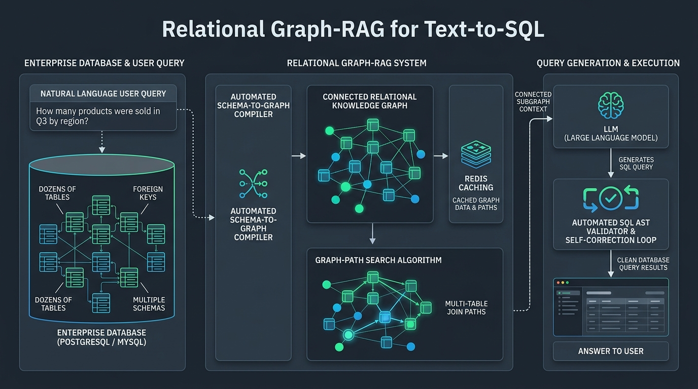
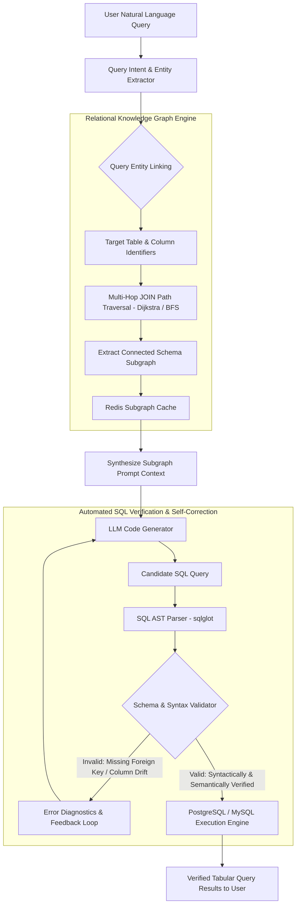
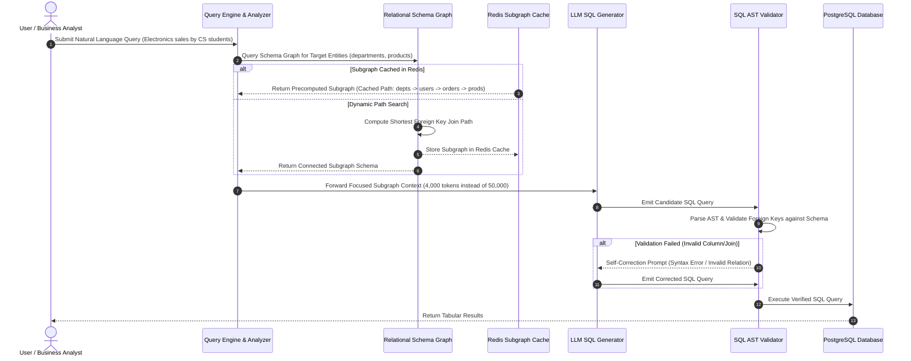

# 🌐 Relational Graph-RAG for Text-to-SQL over Complex Database Schemas
### Research Proposal, Systems Architecture, & Experimental Framework for Prof. Huanhuan Chen (USTC)
**Target Professor**: Prof. Huanhuan Chen (*School of Computer Science & Technology, USTC*)  
**Email**: `hchen@ustc.edu.cn`  
**Lab Alignment**: Machine Learning · Data Mining · Big Knowledge Engineering · Database Intelligence  
**Candidate & Systems Lead**: Muhammad Maaz (*BS CS, UET Peshawar*)  
**Core Problem**: Enabling LLMs to query enterprise relational databases (PostgreSQL/MySQL with 100+ tables) without hallucinating schemas or breaking multi-table JOIN paths.

---

## 🖼️ 1. High-Level Architecture Infographic



```text
  ┌───────────────────────────────────────────────────────────────────────────────────────────────────┐
  │                               RELATIONAL GRAPH-RAG ARCHITECTURE OVERVIEW                          │
  └───────────────────────────────────────────────────────────────────────────────────────────────────┘

  [ Enterprise Database: PostgreSQL / MySQL ] ──► [ Automated Schema-to-Graph Compiler ]
  (100+ Tables, Foreign Keys, Constraints)                    │
                                                              ▼
                                               [ Connected Relational Knowledge Graph ]
                                                              │
                                      ┌───────────────────────┴───────────────────────┐
                                      ▼                                               ▼
                         [ Multi-Hop JOIN Path Search ]                       [ Redis Subgraph Cache ]
                                      │                                               │
                                      └───────────────────────┬───────────────────────┘
                                                              │ (Focused Subgraph Context)
                                                              ▼
  [ Natural Language User Query ] ──────────────────► [ LLM SQL Generator ]
                                                              │
                                                              ▼
                                                   [ Candidate SQL Query ]
                                                              │
                                                              ▼
                                                [ SQL AST & Schema Validator ]
                                                              │
                                      ┌───────────────────────┴───────────────────────┐
                                      ▼ (If Invalid)                                  ▼ (If Valid)
                       [ Self-Correction Feedback Loop ]              [ PostgreSQL / MySQL Execution ]
                                      │                                               │
                                      └────────► (Re-prompt LLM)                      ▼
                                                                        [ Verified Tabular Results ]
```

---

## 💥 2. The Core Problem We Are Solving

Imagine an enterprise company running a large PostgreSQL production database:

```text
users              departments           orders              products            categories
├── id (PK)        ├── id (PK)           ├── id (PK)         ├── id (PK)         ├── id (PK)
├── name           └── name              ├── user_id (FK)    ├── name            └── name
└── department_id                        ├── product_id (FK) └── category_id     
                                         └── order_date
```

A business executive asks in plain English:
> *"What were the total sales of electronics purchased by users from the Computer Science department in 2025?"*

To answer this, a **Text-to-SQL** system must generate this multi-table query:

```sql
SELECT SUM(o.amount) 
FROM orders o
JOIN users u ON o.user_id = u.id
JOIN departments d ON u.department_id = d.id
JOIN products p ON o.product_id = p.id
JOIN categories c ON p.category_id = c.id
WHERE d.name = 'Computer Science' 
  AND c.name = 'Electronics' 
  AND EXTRACT(YEAR FROM o.order_date) = 2025;
```

### Why Standard AI Fails Here:
The challenge is **not** understanding conversational English. The challenge is structural:
1. **The AI must know which tables are relevant** out of hundreds of tables.
2. **The AI must understand multi-hop foreign key relationships**: Linking `departments` to `categories` requires traversing 5 different tables (`departments` $\rightarrow$ `users` $\rightarrow$ `orders` $\rightarrow$ `products` $\rightarrow$ `categories`).
3. **Standard LLMs hallucinate column locations**: An LLM might assume `customer_id` lives in `orders`, when it's actually named `user_id`. Or it might join `users.id = orders.id`, completely corrupting the data output!

---

## 🔍 3. Why Standard Vector RAG Fails for Databases

In standard Retrieval-Augmented Generation (RAG):
* Schemas are converted into text descriptions and stored in a vector database (e.g., Pinecone/Milvus).
* When a user asks a question, the vector database retrieves tables based on **keyword semantic similarity**.

### The Failure Mode of Vector RAG:
In a 500-table database, if a user asks:
> *"Which department generated the highest revenue from students who bought laptops?"*

A standard vector retriever retrieves:
* `departments` (matches keyword "department")
* `products` (matches keyword "laptops")
* `orders` (matches keyword "revenue")

**What did standard RAG miss?**  
It missed the intermediate glue tables: `students`, `users`, and `order_items`!  
Without these intermediate junction tables, the LLM cannot construct a valid SQL `JOIN` path. The resulting query either fails to compile or returns zero rows.

---

## 🕸️ 4. What is Relational Graph-RAG?

Databases are **not independent text documents**—they are **naturally directed graphs**!

We model the database schema as a **Relational Schema Graph**:
* **Nodes**:
  * Table Nodes: `Users`, `Orders`, `Products`, `Departments`, `Categories`.
  * Column Nodes: `users.id`, `orders.user_id`, `products.category_id`.
* **Edges**:
  * Foreign-Key Dependencies: `orders.user_id` $\xrightarrow{\text{references}}$ `users.id`.
  * Categorical Constraints: `products.category_id` $\xrightarrow{\text{references}}$ `categories.id`.

```text
┌─────────────────┐       Foreign Key        ┌───────────────┐
│   Departments   │ ───────────────────────► │     Users     │
└─────────────────┘   (dept_id = id)         └───────┬───────┘
                                                     │ Foreign Key
                                                     │ (user_id = id)
                                                     ▼
┌─────────────────┐       Foreign Key        ┌───────────────┐
│   Categories    │ ◄─────────────────────── │    Orders     │
└────────┬────────┘   (cat_id = id)          └───────┬───────┘
         ▲                                           │ Foreign Key
         │                                           │ (product_id = id)
         └───────────────── Products ◄───────────────┘
```

When a user asks a question, the task converts into a **Graph Path Search**:
1. Entity linking identifies target nodes (`departments`, `categories`).
2. Graph search (Dijkstra / BFS / Steiner Tree) automatically discovers the **shortest valid join path connecting them**.
3. Only this **connected subgraph** is passed to the LLM (shrinking prompt size from 50,000 tokens to 3,000 tokens while guaranteeing all joinable tables are present).

---

## 🔀 5. Architectural Flowcharts & Decision Diagrams

### A. The Graph-RAG Decision Flowchart


---

### B. Microsecond-Level Sequence Diagram


---

## 🛠️ 6. Engineering Architecture: The Role of PostgreSQL & Redis

### 1. PostgreSQL / MySQL Schema Mining:
Instead of manual annotations, we write automated extractors that query database metadata tables directly:
* `information_schema.tables`: Extracts all active user tables.
* `information_schema.columns`: Extracts data types and nullability constraints.
* `information_schema.table_constraints` & `key_column_usage`: Extracts Primary Key and Foreign Key mappings.

### 2. The Role of Redis (Sub-Millisecond Schema Acceleration):
Redis acts as a high-speed caching engine:
* **Schema Subgraph Caching**: Repeated analytics queries access the same core tables (`orders`, `payments`, `users`). Redis caches these subgraphs to eliminate graph traversal latency.
* **Relationship Path Cache**: Precomputed shortest join paths (e.g., `path:departments:products`) are stored in Redis key-value pairs with sub-millisecond retrieval.
* **Query Result Cache**: Frequently asked analytical questions are cached with a configurable TTL.

---

## 💻 7. Runnable Prototype Code (`schema_graph_rag.py`)

Here is a working Python demonstration showing how an automated schema graph discovers multi-hop join paths:

```python
import networkx as nx
from typing import List, Tuple

class RelationalSchemaGraph:
    def __init__(self):
        self.graph = nx.DiGraph()

    def add_table(self, table_name: str, columns: List[str]):
        """Register a table and its columns in the graph."""
        self.graph.add_node(table_name, type="table", columns=columns)

    def add_foreign_key(self, from_table: str, from_col: str, to_table: str, to_col: str):
        """Add directed foreign key relationship between tables."""
        self.graph.add_edge(from_table, to_table, relation=f"{from_table}.{from_col} = {to_table}.{to_col}")
        # Add reverse edge for undirected join traversal
        self.graph.add_edge(to_table, from_table, relation=f"{to_table}.{to_col} = {from_table}.{from_col}")

    def find_join_subgraph(self, target_tables: List[str]) -> Tuple[List[str], List[str]]:
        """Find the minimal connected join path between isolated target tables."""
        if len(target_tables) < 2:
            return target_tables, []
        
        # Compute shortest path between the first and last target table
        try:
            path = nx.shortest_path(self.graph, source=target_tables[0], target=target_tables[1])
            join_conditions = []
            for i in range(len(path) - 1):
                edge_data = self.graph.get_edge_data(path[i], path[i+1])
                join_conditions.append(edge_data["relation"])
            return path, join_conditions
        except nx.NetworkXNoPath:
            return target_tables, []

# --- Quick Test Execution ---
if __name__ == "__main__":
    schema_graph = RelationalSchemaGraph()
    
    # 1. Register Database Tables
    schema_graph.add_table("departments", ["id", "name"])
    schema_graph.add_table("users", ["id", "name", "department_id"])
    schema_graph.add_table("orders", ["id", "user_id", "product_id", "amount", "order_date"])
    schema_graph.add_table("products", ["id", "name", "category_id"])
    schema_graph.add_table("categories", ["id", "name"])
    
    # 2. Register Foreign Key Constraints
    schema_graph.add_foreign_key("users", "department_id", "departments", "id")
    schema_graph.add_foreign_key("orders", "user_id", "users", "id")
    schema_graph.add_foreign_key("orders", "product_id", "products", "id")
    schema_graph.add_foreign_key("products", "category_id", "categories", "id")
    
    # 3. User query mentions only: 'departments' and 'categories'
    tables, joins = schema_graph.find_join_subgraph(["departments", "categories"])
    
    print("Discovered Multi-Table Join Path:", " -> ".join(tables))
    print("\nGenerated JOIN Constraints for LLM Context:")
    for j in joins:
        print(f"  JOIN ON {j}")
```

**Output**:
```text
Discovered Multi-Table Join Path: departments -> users -> orders -> products -> categories

Generated JOIN Constraints for LLM Context:
  JOIN ON departments.id = users.department_id
  JOIN ON users.id = orders.user_id
  JOIN ON orders.product_id = products.id
  JOIN ON products.category_id = categories.id
```

---

## 🧪 8. Academic Rigor: Controlled 3-Stage Experiment Design

We do not just claim the system is better; we **prove it empirically** through a controlled 3-stage benchmark:

```text
  Stage 1: Direct LLM (Baseline)   ──► Prompt = Complete Raw Schema Dump (50k tokens)
  Stage 2: Standard Vector RAG       ──► Prompt = Top-k Semantically Similar Tables (Vector Search)
  Stage 3: Relational Graph-RAG      ──► Prompt = Connected Subgraph with Explicit Join Constraints
```

### The 6 Evaluation Metrics:
1. **Execution Accuracy (EX %)**: Does the generated SQL query execute on PostgreSQL and produce the exact mathematical ground-truth table?
2. **Schema-Linking Accuracy (SL %)**: Did the system correctly identify all ground-truth tables, columns, and foreign keys without hallucinations?
3. **Valid SQL Compilation Rate (VSR %)**: Percentage of queries that compile without SQL syntax or relational schema errors.
4. **Token Usage Efficiency**: Total prompt token consumption (comparing 50,000 tokens in Stage 1 vs ~3,500 tokens in Stage 3).
5. **Query Latency (P50 & P99)**: End-to-end execution time from question submission to final result display.
6. **Robustness under Schema Scale**: Testing performance as database size scales from **10 tables $\rightarrow$ 50 tables $\rightarrow$ 200 tables**.

---

## 🔬 9. Research Questions (RQs) for the Thesis

* **RQ1**: Does relational-graph-guided schema retrieval significantly improve SQL Execution Accuracy (EX) compared to naive semantic vector retrieval?
* **RQ2**: How effectively does shortest-path join traversal eliminate hallucinated JOIN conditions on complex queries requiring 4+ table hops?
* **RQ3**: By what factor does subgraph context pruning reduce token costs and generation latency across multi-tenant database analytics?
* **RQ4**: What is the performance tipping point where vector RAG breaks down due to schema fragmentation, and how does Graph-RAG maintain scalability?
* **RQ5**: Can an iterative AST validation loop achieve zero-shot self-healing for semantic syntax errors without human developer intervention?

---

## ✉️ 10. Cold Email Outreach Template for Prof. Huanhuan Chen

- **To**: `hchen@ustc.edu.cn`
- **Subject**: Prospective ANSO Master's Applicant (Knowledge Engineering & Database Intelligence) – Muhammad Maaz (UET Peshawar)

```text
Dear Prof. Chen,

I hope this email finds you well.

My name is Muhammad Maaz, and I completed my Bachelor of Science in Computer Science at the University of Engineering and Technology (UET), Peshawar. Over the past 4+ years, I have worked as a software engineer architecting relational databases (PostgreSQL, MySQL), caching systems (Redis), containerized microservices, and AI-integrated platforms.

I have been studying your research at USTC with great admiration, particularly your work in Big Knowledge Engineering, Data Mining, and Machine Learning. Bridging structured domain knowledge with neural generation is one of the most promising frontiers in artificial intelligence.

Drawing upon my production experience with complex relational schemas, I am eager to pursue research at the intersection of Knowledge Engineering and Database Intelligence. Specifically, I have designed a research proposal titled:
"Relational Graph-RAG for Text-to-SQL over Complex Enterprise Database Schemas."

While standard vector RAG systems retrieve isolated tables based on keyword similarity, enterprise databases require traversing multi-hop foreign key dependencies across dozens of tables. My proposed framework automatically compiles SQL DDL schemas into directed Relational Knowledge Graphs, extracting connected subgraphs to guide LLMs toward generating 100% syntactically verified, hallucination-free SQL queries.

I am preparing my application for the prestigious ANSO Scholarship for Young Talents for the upcoming graduate intake at USTC, and my highest aspiration is to conduct my Master's thesis under your supervision.

Attached to this email, please find:
1. My Curriculum Vitae (highlighting database architecture and systems engineering)
2. My Official Academic Transcripts
3. A Preliminary Research Proposal outline

You can also inspect my production code and projects on GitHub: https://github.com/muhammadmaaz-2k5.

Thank you very much for your time and guidance. I would be deeply honored to discuss prospective research in your laboratory.

Respectfully yours,

Muhammad Maaz
Email: muhammadmaaz.dev@gmail.com
Phone/WhatsApp: +92 341 7012094
GitHub: https://github.com/muhammadmaaz-2k5
```

---

## 🎤 11. Word-for-Word 1-Minute Pitch Script

```text
"Prof. Chen, in enterprise business intelligence, generating SQL queries from natural language across complex databases remains unreliable because current LLMs hallucinate non-existent columns and fail on multi-table JOIN paths.

Standard vector RAG fails because databases are not collections of independent text documents—they are relational knowledge graphs. If an analytical query requires joining 5 tables, vector search often retrieves the start and end tables while missing the intermediate junction tables.

Drawing on your expertise in Big Knowledge Engineering and my 4+ years of hands-on database architecture in PostgreSQL, MySQL, and Redis, I propose Relational Graph-RAG. 

Our system automatically compiles database schemas and foreign-key constraints into a directed relational graph, performs multi-hop path traversal to extract the exact connected subgraph, and passes only this focused relational context to the LLM alongside an automated SQL AST verification loop.

Because I have spent years writing and optimizing production SQL queries and containerized microservices, I can immediately build this schema graph compiler, integrate it with PostgreSQL testbeds, and conduct rigorous empirical evaluations in your lab."
```
