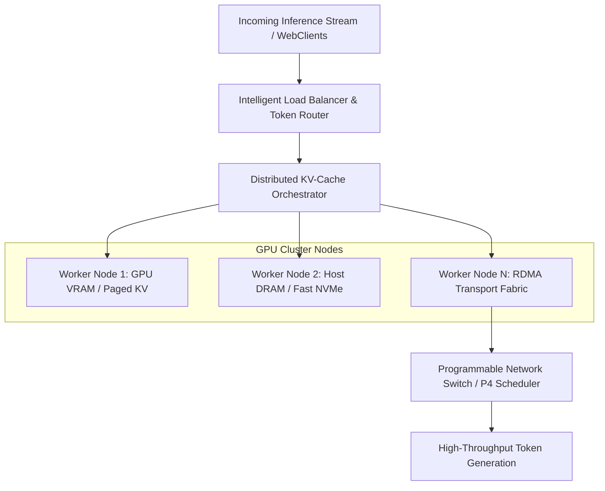
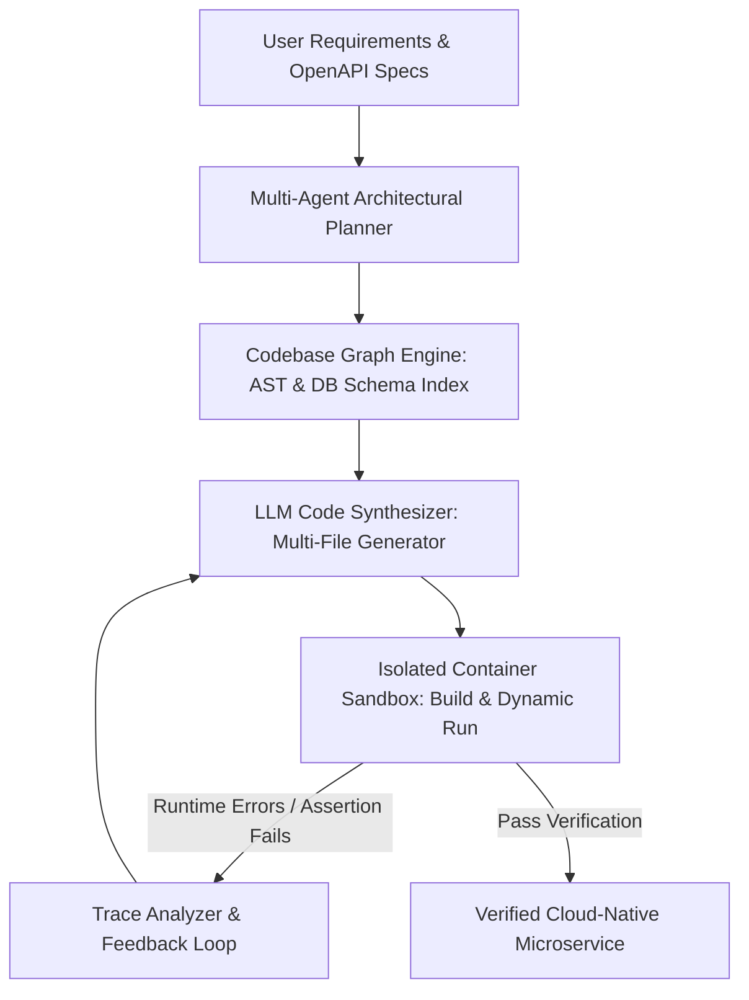

# ANSO Scholarship Research Proposals & Supervisor Selection Guide
### University of Science and Technology of China (USTC) & University of Chinese Academy of Sciences (UCAS)

[](http://www.anso.org.cn/)
[](https://ic.ustc.edu.cn/)
[](https://github.com/muhammadmaaz-2k5)
[]()

---

## 📌 Executive Summary

This repository contains a strategic analysis and two comprehensive, publication-grade academic research proposals tailored for the **ANSO Scholarship for Young Talents (Alliance of International Science Organizations)** application for Master's/Ph.D. degree programs at:
1. **University of Science and Technology of China (USTC)** – Hefei, Anhui
2. **University of Chinese Academy of Sciences (UCAS)** – Beijing / CAS Institutes

### Candidate Profile Summary: Muhammad Maaz
- **Academic Background**: Bachelor of Science in Computer Science, University of Engineering and Technology (UET), Peshawar.
- **Industry & Systems Experience**: 4+ years of full-stack engineering, distributed systems, real-time WebSocket communication ([PakChess](https://github.com/muhammadmaaz-2k5)), Redis caching, containerized cloud infrastructure (Docker, AWS, GCP, CI/CD), and AI-integrated platforms ([Notion AI Clone](https://github.com/muhammadmaaz-2k5)).
- **Core Research Value Proposition**: Bridging production engineering, high-concurrency systems, and cloud infrastructure with academic research in **Distributed AI Systems (LLM Infrastructure)** and **Intelligent Software Engineering (AI for Code)**.

---

## 🏛️ Comprehensive Faculty Directory & Match Analysis

Extracted and evaluated from `ResearchPaperTeacherForScholarship.docx`:

### 1. University of Science and Technology of China (USTC)
*School of Computer Science and Technology*

| Professor | Research Areas | Email | Match Score | Key Suitability Notes |
| :--- | :--- | :--- | :---: | :--- |
| **Junxue Zhang** | **Networked Systems for LLMs, High-Performance Datacenter Networking** | `snowzjx@ustc.edu.cn` | **10 / 10** | **#1 Recommended USTC Supervisor**. Explores GPU clustering, networking bottlenecks, and communication for distributed LLMs. Perfect match for backend/networking background. |
| **Jianchun Liu** | SDN, NFV, Edge Computing, Federated Learning, IoT | `jcliu17@ustc.edu.cn` | **8.5 / 10** | High match for distributed cloud-edge systems and federated learning synchronization. |
| **Nikolaos M. Freris** | AIoT, Optimization, Cyber-Physical Systems | `nfr@ustc.edu.cn` | **8.5 / 10** | Outstanding international profile; English-native research group with strong global collaborations. |
| **Yun Xu (徐云)** | Big Data Mining, HPC, Bioinformatics, Parallel Models | `xuyun@ustc.edu.cn` | **7.5 / 10** | Strong focus on parallel computing and high-performance algorithms. |
| **Kejiang Chen** | Data Hiding, Adversarial Learning, Deepfake Detection | `chenkj@ustc.edu.cn` | **7.0 / 10** | Information security and adversarial AI focus. |
| **Chang Xiaojun (常晓军)** | Multimodal Large Models, Computer Vision, Green AI | `xjchang@ustc.edu.cn` | **7.5 / 10** | Highly active in foundation models and green AI efficiency. |
| **Li Jing (李京)** | Computer Science, Software Engineering | `lj@ustc.edu.cn` | **7.0 / 10** | Software engineering domain focus. |
| **Huang Liusheng** | Network and High-Performance Computing | `lshuang@ustc.edu.cn` | **7.0 / 10** | High-performance networking background. |
| **Huanhuan Chen** | Machine Learning, Evolutionary Computation | `hchen@ustc.edu.cn` | **7.0 / 10** | Machine learning and big knowledge engineering. |
| **Defu Lian** | Data Science, Computer Science and Technology | `liandefu@ustc.edu.cn` | **7.0 / 10** | Recommender systems and data mining. |
| **Ren Shaoqing (任少卿)** | Computer Vision, Intelligent Science & Technology | `sqren@ustc.edu.cn` | **6.5 / 10** | World-renowned author of Faster R-CNN; requires deep vision theory. |
| **Liu Ligang (刘利刚)** | Computer Graphics | `lgliu@ustc.edu.cn` | **6.0 / 10** | Geometric modeling and computer graphics. |
| **An Hong (安虹)** | Computer Architecture and Parallel Processing | `han@ustc.edu.cn` | **7.0 / 10** | HPC architecture and parallel supercomputing. |
| **Zhou Xuehai (周学海)** | Computer Science and Technology | `xhzhou@ustc.edu.cn` | **6.5 / 10** | Systems and computer engineering. |
| **Jiahui Hou** | Computer Science | `jhhou@ustc.edu.cn` | **6.5 / 10** | Emerging computer science systems. |

---

### 2. University of Chinese Academy of Sciences (UCAS)
*School of Computer Science & CAS Institutes (ISCAS, ICT)*

| Professor | Research Areas | Email | Match Score | Key Suitability Notes |
| :--- | :--- | :--- | :---: | :--- |
| **Li Ling (李玲)** | **Intelligent Computing, Large Models, High-Performance Code Generation** (ISCAS) | `liling@iscas.ac.cn` | **10 / 10** | **#1 Recommended UCAS Supervisor**. Researches automated code synthesis, code intelligence, and software generation with LLMs. Ideal fit for a seasoned software engineer. |
| **Wang Yong (王泳)** | Data Mining, Machine Learning, Pattern Recognition, NLP | `wangyong@ucas.ac.cn` | **8.0 / 10** | Strong NLP and data mining group; versatile machine learning research. |
| **Jia Weile (贾伟乐)** | AI for Science, HPC, Scientific Computing (ICT) | `jiaweile@ict.ac.cn` | **7.5 / 10** | High-performance computing and physics/chemistry-informed AI. |
| **Chen Yunji (陈云霁)** | Chip Architecture, Machine Learning (ICT) | `cyj@ict.ac.cn` | **7.0 / 10** | Pioneer of Cambricon deep learning processors; hardware-focused. |
| **Su Li (苏荔)** | Multimedia Technology, Image Processing, Computer Vision | `suli@ucas.ac.cn` | **6.5 / 10** | Multimedia analytics and computer vision. |
| **Ma Bingpeng (马丙鹏)** | Computer Vision, Multimedia Technology, Machine Learning | `bpma@ucas.ac.cn` | **6.5 / 10** | Person re-identification and visual recognition. |
| **Wang Yuewu (王跃武)** | Cryptography, Information Security | `wangyuewu@ucas.ac.cn` | **6.5 / 10** | Network security and cryptography. |
| **Li Baobin (李保滨)** | Computer Graphics, Big Data Analysis, Affective Computing | `libb@ucas.ac.cn` | **6.5 / 10** | Multimodal data analysis and graphics. |
| **Wang Weiqiang (王伟强)** | Computer Vision, Multimedia Technology | `wqwang@ucas.ac.cn` | **6.0 / 10** | Multimedia indexing and vision. |
| **Liu Yan (刘艳)** | Digital Image and Video Processing | `yanliu@ucas.ac.cn` | **6.0 / 10** | Video coding and digital image processing. |
| **Xu Jungang (徐俊刚)** | Computer Science and Technology | `xujg@ucas.ac.cn` | **6.0 / 10** | Applied machine learning and systems. |
| **Gu Jianjun (顾建军)** | Computer Application Technology, Bioinformatics | `jianjun.gu@ucas.ac.cn` | **6.0 / 10** | Computational biology and algorithms. |
| **Shen Haihua (沈海华)** | Computer Science and Technology | `shenhh@ucas.ac.cn` | **6.0 / 10** | Systems and database technology. |

---

# 🎓 Research Proposal 1: USTC Focus

### Proposed Supervisor: **Prof. Junxue Zhang**
- **Institution**: University of Science and Technology of China (USTC)
- **Email**: `snowzjx@ustc.edu.cn`
- **Department**: School of Computer Science and Technology

```text
Title: Intelligent Traffic Scheduling and Memory-Aware Caching for High-Throughput Distributed Large Language Model Serving
Discipline: Computer Science and Technology / Networked Systems
Target Degree: Master of Science (ANSO Scholarship)
```

### 1. Abstract
The deployment of Large Language Models (LLMs) across distributed data centers suffers from communication bottlenecks and memory fragmentation. Auto-regressive decoding creates uneven token-by-token traffic, high Key-Value (KV) cache memory footprint, and significant inter-GPU networking stalls across InfiniBand/RoCE fabrics. This research proposes **NetLLM-Cache**, a distributed serving framework that couples transport-layer traffic prioritization with a hierarchical, cross-node KV-cache scheduling engine. By unifying network-aware token scheduling and host-to-device memory tiering, the system aims to slash Time-To-First-Token (TTFT) by over 35% and boost inference throughput under multi-tenant production workloads.

### 2. Problem Statement & Motivation
Existing distributed serving systems (e.g., vLLM, DeepSpeed-FastGen, TensorRT-LLM) optimize single-host memory through techniques like PagedAttention. However, in cluster-scale multi-GPU deployments:
1. **Network Contention**: Dynamic prompt sizes cause bursts in tensor-parallel and pipeline-parallel communication, congesting shared top-of-rack (ToR) switches.
2. **Suboptimal KV-Cache Eviction**: Multi-turn dialogue systems discard computed attention states across requests, repeatedly incurring redundant computation.
3. **Decoupled Systems**: Current schedulers treat network transport and memory caching as disjoint layers, failing to anticipate network load when migrating KV-caches across cluster nodes.

### 3. Research Questions
1. *RQ1*: How can we predictively schedule distributed inference requests at the packet level to eliminate head-of-line blocking in GPU clusters?
2. *RQ2*: How can a cluster-wide hierarchical KV-cache (GPU VRAM $\rightarrow$ Host DRAM $\rightarrow$ NVMe) be orchestrated across RDMA networks with near-zero latency penalty?
3. *RQ3*: How can dynamic attention sparsity patterns inform network transmission priority for latency-sensitive prompt tokens?

### 4. Proposed Architecture & Methodology



- **Module A: Hierarchical Distributed KV-Cache (NetCache Engine)**:
  Build a tiered distributed cache daemon running alongside GPU nodes using Redis-like shared memory indices and high-speed RDMA read/write primitives to synchronize attention prefixes.
- **Module B: Network-Aware Request Dispatcher**:
  Implement an intelligent token scheduling algorithm that routes requests based on both GPU compute load and cluster fabric queue depths.
- **Module C: Hardware-in-the-Loop Simulation & Prototype**:
  Deploy the framework on a containerized cluster (Docker/Kubernetes) evaluating LLM models (Llama 3, DeepSeek-V2) using synthetic and real-world trace datasets (ShareGPT, LMSYS-Chatbot-Arena).

### 5. Expected Contributions
1. A production-ready open-source distributed serving plugin compatible with vLLM/vllm-project.
2. A formal network-memory co-design scheduling model for multi-tenant inference clusters.
3. At least one high-impact paper submitted to top-tier conferences (e.g., ACM SIGCOMM, NSDI, or EuroSys).

---

# 🤖 Research Proposal 2: UCAS Focus

### Proposed Supervisor: **Prof. Li Ling (李玲)**
- **Institution**: University of Chinese Academy of Sciences (UCAS) / Institute of Software, Chinese Academy of Sciences (ISCAS)
- **Email**: `liling@iscas.ac.cn`
- **Department**: Intelligent Computing / High-Performance Code Generation

```text
Title: LLM-Driven Autonomous Code Generation and Formal Verification for Resilient Cloud-Native Microservices
Discipline: Software Engineering and Intelligent Computing
Target Degree: Master of Science (ANSO Scholarship)
```

### 1. Abstract
While modern code foundation models (e.g., DeepSeek-Coder, StarCoder, CodeLlama) show high competence on single-function code synthesis, their application to **multi-tier, repository-scale software architectures** remains severely constrained. Generated code frequently contains subtle concurrency race conditions, unhandled API schema drift, and resource leaks. This research proposes **MicroGen-Verify**, an end-to-end framework integrating retrieval-augmented code intelligence with static semantic parsing and containerized dynamic verification to synthesize resilient, production-ready cloud-native microservices.

### 2. Problem Statement & Motivation
Enterprise software engineering relies on interconnected distributed components (REST/GraphQL endpoints, database transaction isolations, message queues, and caching layers). Current code LLMs fail in these settings because:
1. **Context Window Fragmentation**: Models lack complete awareness of cross-file imports, schema definitions, and cloud configuration files.
2. **Absence of Grounded Verification**: Synthesized code is evaluated only on syntactical correctness, ignoring runtime invariants, network timeouts, and concurrency hazards.
3. **Lack of Automated Self-Correction**: When tests or compilation fail, models lack structured execution traces to perform precise multi-turn bug localization.

### 3. Research Questions
1. *RQ1*: How can we build an Abstract Syntax Tree (AST) and Dependency Graph memory index that enables LLMs to reason over distributed microservice repositories?
2. *RQ2*: Can static API contract validation and automated unit-test generation be combined inside an execution sandbox to eliminate runtime software failures?
3. *RQ3*: How can dynamic execution traces (e.g., Docker container runtime logs) be encoded into prompt feedback loops for zero-shot bug self-healing?

### 4. Proposed Architecture & Methodology



- **Module 1: Codebase Graph Retrieval Engine**:
  Parses full project trees into unified knowledge graphs linking route definitions, database models (Prisma, SQL schemas), and middleware functions.
- **Module 2: Containerized Verification Pipeline**:
  Each synthesized code block is immediately pushed into an ephemeral Docker container sandbox running automated linters, static security scanners, and synthetic load tests.
- **Module 3: Error Trace Attribution & Repair**:
  Transforms container stderr, database deadlocks, and network connection logs into structured semantic prompts that guide the model to perform precise surgical edits.

### 5. Expected Contributions
1. A comprehensive benchmark dataset of multi-service backend challenges (concurrency, API evolution, database deadlocks).
2. An open-source multi-agent code generation and verification system for cloud architectures.
3. Publication in leading software engineering and AI venues (e.g., ICSE, FSE, or ASE).

---

# ✉️ Email Outreach Templates for Professors

### Template 1: For Prof. Junxue Zhang (USTC)
- **To**: `snowzjx@ustc.edu.cn`
- **Subject**: Prospective ANSO Master's Applicant (Systems for LLMs) – Muhammad Maaz (UET Peshawar)

```text
Dear Prof. Zhang,

I hope this email finds you well.

My name is Muhammad Maaz, and I graduated with a Bachelor's degree in Computer Science from the University of Engineering and Technology (UET), Peshawar. Over the past 4+ years, I have worked as a software engineer specializing in distributed backend systems, real-time networking (WebSockets), Redis caching layers, and containerized cloud deployments (Docker, AWS, CI/CD).

I have been following your lab’s pioneering work on networked systems for Large Language Models and high-performance datacenter networking at USTC with great enthusiasm. The problem of inter-GPU communication bottlenecks and KV-cache overhead during distributed inference is one of the most critical challenges in computer systems today.

Drawing on my background in high-concurrency systems and network protocols, I have developed a preliminary research proposal entitled:
"Intelligent Traffic Scheduling and Memory-Aware Caching for High-Throughput Distributed Large Language Model Serving."

I am applying for the prestigious ANSO Scholarship for Young Talents for the upcoming graduate intake at USTC, and my highest ambition is to pursue my Master’s thesis under your mentorship.

Attached to this email, please find:
1. My Curriculum Vitae (highlighting systems engineering and projects)
2. My Official Academic Transcripts
3. A 2-page Research Proposal aligned with your lab's direction

I would be deeply honored to discuss my background and research ideas with you if you have availability. Thank you very much for your time and guidance.

Respectfully yours,

Muhammad Maaz
Email: muhammadmaaz.dev@gmail.com
Phone/WhatsApp: +92 341 7012094
GitHub: https://github.com/muhammadmaaz-2k5
Portfolio: [Your Portfolio Link]
```

---

### Template 2: For Prof. Li Ling (UCAS / ISCAS)
- **To**: `liling@iscas.ac.cn`
- **Subject**: Prospective ANSO Master's Applicant (LLM Code Generation) – Muhammad Maaz (UET Peshawar)

```text
Dear Prof. Li,

I hope you are having a productive week.

My name is Muhammad Maaz, a Computer Science graduate from the University of Engineering and Technology (UET), Peshawar. With 4+ years of hands-on software development experience, I have architected and deployed production web services, complex API contracts, and real-time platforms using modern full-stack frameworks and AI tooling.

I am thoroughly impressed by your team’s research at the Institute of Software, Chinese Academy of Sciences (ISCAS) on Large Models and High-Performance Code Generation. While existing foundation models generate basic functions easily, deploying AI code in production microservices requires repository-wide context, database schema consistency, and automated execution verification.

Because of my engineering experience with production systems, I have prepared a research proposal titled:
"LLM-Driven Autonomous Code Generation and Formal Verification for Resilient Cloud-Native Microservices."

I am applying for the ANSO Scholarship for Young Talents at UCAS, and my primary goal is to conduct research under your supervision at ISCAS.

I have attached my CV, academic transcripts, and the research proposal for your consideration. I would be thrilled to receive your feedback and discuss prospective graduate research in your group.

Thank you very much for your time and consideration.

Sincerely,

Muhammad Maaz
Email: muhammadmaaz.dev@gmail.com
Phone/WhatsApp: +92 341 7012094
GitHub: https://github.com/muhammadmaaz-2k5
Portfolio: [Your Portfolio Link]
```

---

# 🚀 Git Repository Setup & Commands

To initialize this repository and sync it with your remote GitHub repository (`https://github.com/muhammadmaaz-2k5/Research-Paper.git`), run the following commands in your shell:

```bash
# Navigate to the workspace directory
cd "c:\Users\RYZEN 7\Desktop\Thesis\RsearchPaper"

# Initialize Git repository
git init

# Stage the README.md file
git add README.md

# Commit changes
git commit -m "first commit: add ANSO research proposals and faculty guide for USTC & UCAS"

# Set branch to main
git branch -M main

# Link remote GitHub repository
git remote add origin https://github.com/muhammadmaaz-2k5/Research-Paper.git

# Push to GitHub
git push -u origin main
```

---

# 📋 ANSO Scholarship Application Checklist

- [ ] **Provisional Acceptance Letter**: Reach out to Prof. Junxue Zhang (USTC) and Prof. Li Ling (UCAS).
- [ ] **Academic Transcripts & Degree**: Notarized copies of your Bachelor's from UET Peshawar.
- [ ] **Curriculum Vitae**: Highlighting systems, backend development, and academic projects.
- [ ] **Two Recommendation Letters**: Signed by Associate Professors or Full Professors from UET Peshawar.
- [ ] **Research Proposal**: Tailored proposal (from above) in clean PDF format.
- [ ] **Foreigner Physical Examination Form**: Completed at an authorized hospital with blood tests and doctor stamp.
- [ ] **Police Clearance Certificate (Non-Criminal Record)**: Issued within the last 6 months.
- [ ] **English Proficiency Certificate**: Letter from UET Peshawar or official IELTS score.

---
*Created by [Muhammad Maaz](https://github.com/muhammadmaaz-2k5) for ANSO Scholarship 2026/2027 Admissions.*
