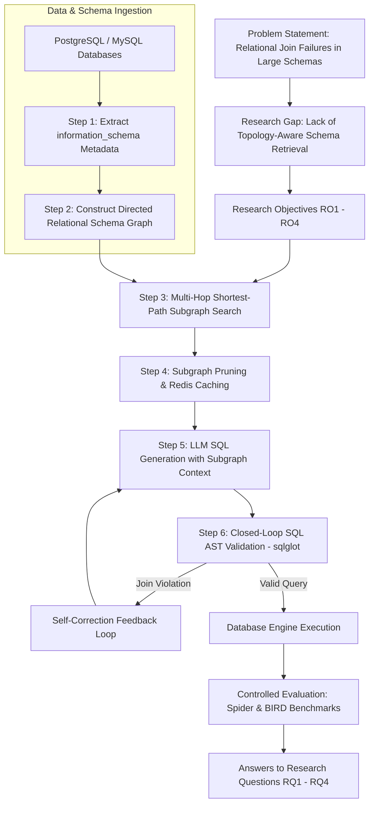
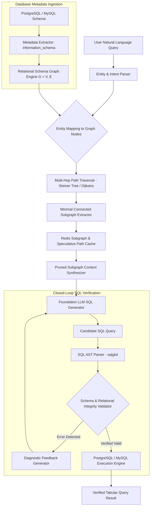

# Relational Graph-RAG:
### A Schema-Topology-Aware Graph Retrieval and AST-Constrained Generation Framework for Robust Text-to-SQL over Complex Enterprise Databases

**Submitted By:**  
Muhammad Maaz Khan  
Registration / Application ID: Prospective MS Applicant (2026/2027)

**Proposed Supervisor:**  
Prof. Shuangwu Chen (Associate Professor)

**Academic Unit:**  
School of Information Science and Technology / School of Computer Science and Technology  
University of Science and Technology of China (USTC), Hefei, Anhui, China  
2026

---

## CANDIDATE'S DECLARATION

I, **Muhammad Maaz Khan**, hereby declare that the research proposal titled **"Relational Graph-RAG: A Schema-Topology-Aware Graph Retrieval and AST-Constrained Generation Framework for Robust Text-to-SQL over Complex Enterprise Databases"** is my own original proposed research formulation for graduate study at the University of Science and Technology of China (USTC). It has not been previously submitted by me for any degree or examination at any other academic institution.

**Candidate Name:** Muhammad Maaz Khan  
**Signature:** __________________________  
**Dated:** October 1, 2026  

---

## TABLE OF CONTENTS

- **List of Tables**
- **List of Figures**
- **List of Abbreviations**
- **CHAPTER 1: INTRODUCTION**
  - 1.1 Introduction
  - 1.2 Problem Statement
  - 1.3 Research Objectives
  - 1.4 Research Questions
  - 1.5 Mapping of Title Elements to Objectives, Questions, & Evidence (Table 1.1)
  - 1.6 Research Significance
- **CHAPTER 2: LITERATURE REVIEW**
  - 2.1 Thematic Literature Review
  - 2.2 Motivation and Comparative Analysis (Table 2.1)
  - 2.3 Research Gap
- **CHAPTER 3: RESEARCH METHODOLOGY**
  - 3.1 Research Methodology Overview
  - 3.2 Research Methodology Flow Diagram (Figure 3.1)
  - 3.3 Step-by-Step Explanation of the Methodology (Steps 1 to 6)
  - 3.4 Planned Datasets and Evaluation Protocols (Tables 3.1 & 3.2)
  - 3.5 Proposed Architecture (Figure 3.2)
  - 3.6 Step-by-Step Explanation of the Proposed Model Components
- **CHAPTER 4: FEASIBILITY, ROADMAP, & LEARNING PLAN**
  - 4.1 Candidate Technical Background & Feasibility
  - 4.2 Research Preparation & Skill Acquisition Plan
  - 4.3 24-Month Master's Research Timeline
  - 4.4 Alignment with Prof. Shuangwu Chen's Laboratory
- **CHAPTER 5: REFERENCES**

---

## LIST OF TABLES

* **Table 1.1**: Mapping of each title element to its research objective, research question, methodology step, model component, and empirical evidence.
* **Table 2.1**: Motivation and comparative analysis of recent studies (2022–2026) related to the title, and the proposed work.
* **Table 3.1**: Planned role, domain characteristics, and schema complexity of benchmark database collections.
* **Table 3.2**: Controlled experimental evaluation protocols and the research questions each protocol answers.

---

## LIST OF FIGURES

* **Figure 1.1**: Conceptual overview of the Relational Graph-RAG multi-table reasoning dilemma.
* **Figure 3.1**: Research methodology flow: from problem statement and research gap through objectives (RO) and steps to research questions (RQ).
* **Figure 3.2**: Detailed technical architecture of the proposed Relational Graph-RAG system.

---

## LIST OF ABBREVIATIONS

| Abbreviation | Full Form |
| :--- | :--- |
| **AST** | Abstract Syntax Tree |
| **BFS** | Breadth-First Search |
| **BIRD** | BIg Bench for Large-Scale Database Grounded Text-to-SQL |
| **DDL** | Data Definition Language |
| **EX** | Execution Accuracy |
| **FK** | Foreign Key |
| **GNN** | Graph Neural Network |
| **HEC** | Higher Education Commission (Pakistan) |
| **JSON** | JavaScript Object Notation |
| **KV** | Key-Value (Attention Cache) |
| **LLM** | Large Language Model |
| **NLIDB** | Natural Language Interfaces to Databases |
| **PK** | Primary Key |
| **RAG** | Retrieval-Augmented Generation |
| **RO** | Research Objective |
| **RQ** | Research Question |
| **SL** | Schema-Linking Recall |
| **SOTA** | State-of-the-Art |
| **SQL** | Structured Query Language |
| **TableQA** | Table-based Question Answering |
| **TTFT** | Time-To-First-Token |
| **UET** | University of Engineering and Technology (Peshawar) |
| **USTC** | University of Science and Technology of China |
| **VSR** | Valid SQL Compilation Rate |

---

# CHAPTER 1: INTRODUCTION

### 1.1 Introduction
Enterprise relational databases serve as the digital bedrock of global commerce, finance, healthcare, and public administration. Natural Language Interfaces to Databases (NLIDB) aim to democratize data analytics by translating unstructured conversational user questions directly into executable Structured Query Language (SQL) queries (Text-to-SQL). Recent breakthroughs in foundation Large Language Models (LLMs) have substantially advanced syntactic parsing. However, realistic enterprise systems do not store data in single isolated tables; they enforce third normal form (3NF) across dozens to hundreds of relational tables interconnected by complex primary and foreign-key dependencies.

When an analytical question requires computing aggregate metrics across distant business entities (e.g., *"What were total electronics sales purchased by Computer Science students in 2025?"*), the query engine must identify and join a sequence of distinct tables: `departments` $\rightarrow$ `users` $\rightarrow$ `orders` $\rightarrow$ `products` $\rightarrow$ `categories`. In this setting, the central challenge is not natural language comprehension, but **relational schema topology linking**.

Existing approaches fall into two problematic extremes. On one hand, direct prompting feeds raw Data Definition Language (DDL) dumps into the LLM context window. In complex databases, this inflates prompt sizes to tens of thousands of tokens, incurring severe financial costs, latency bottlenecks, and attention degradation ("Lost in the Middle"). On the other hand, conventional Retrieval-Augmented Generation (RAG) models schemas as collections of independent text documents, retrieving tables via semantic vector similarity. Because dense embeddings evaluate semantic overlap rather than relational topology, vector retrieval routinely selects terminal tables matching user keywords (e.g., `departments` and `products`) while omitting the intermediate junction tables (`users` and `orders`) necessary to satisfy relational joins. The resulting queries suffer from schema hallucinations, unconstrained Cartesian products, and runtime execution errors.

This research addresses these limitations through **Relational Graph-RAG**, a topology-aware framework that formalizes relational database metadata as a directed knowledge graph. By executing structural path traversals across foreign-key dependencies, the framework extracts the minimal connected subgraph required to bridge user entities. This subgraph is paired with an Abstract Syntax Tree (AST) validation loop that verifies join constraints before database execution.

---

### 1.2 Problem Statement
Existing Text-to-SQL frameworks fail when deployed on complex enterprise relational databases due to two coupled structural weaknesses: **relational blindness in schema retrieval** and **unconstrained multi-table join synthesis**. 

First, vector-based RAG frameworks treat database schemas as unstructured text chunks. In normalized databases containing 50 to 200+ tables, semantic vector similarity fails to identify bridging junction tables that lack lexical overlap with the user query, causing broken multi-table join paths. Second, current LLMs generate SQL queries auto-regressively without explicit structural verification against database foreign-key constraints. Consequently, models generate syntactically plausible queries that join tables on non-existent keys, assume columns reside in incorrect relations, or trigger execution failures on production databases. 

The problem addressed in this study is the **absence of a reproducible, topology-aware schema retrieval and verification framework that guarantees relational join connectivity over complex enterprise schemas, eliminates disconnected table hallucinations, and operates efficiently within strict token and latency bounds**.

---

### 1.3 Research Objectives
* **RO1 (Topology-Aware Graph Formalization)**: To formalize relational database metadata (tables, attributes, primary keys, and foreign keys) as a directed Relational Schema Graph $G = (V, E)$ via automated extraction from database system catalogs (`information_schema`).
* **RO2 (Multi-Hop Subgraph Retrieval)**: To develop a structural path-search algorithm (evaluating Dijkstra, bidirectional BFS, and Steiner tree heuristics) that identifies the minimal connected join subgraph bridging isolated query entities.
* **RO3 (Speculative Subgraph & Query Caching)**: To engineer a low-latency caching layer (leveraging Redis and speculative KV-cache reuse principles) that caches frequent relational paths and schema subgraphs, minimizing end-to-end query latency.
* **RO4 (Closed-Loop AST Verification & Empirical Benchmarking)**: To establish an automated SQL AST verification loop that detects unconstrained joins before database execution, and to benchmark the framework against baseline prompting and vector-RAG methods on public benchmarks (Spider, BIRD) across execution accuracy, schema-linking recall, and token efficiency.

---

### 1.4 Research Questions
* **RQ1 (Relational Connectivity)**: To what extent does relational-graph-aware schema retrieval improve multi-table Execution Accuracy (EX) and Valid SQL Compilation Rates (VSR) compared to standard vector-RAG and direct prompting baselines on cross-domain benchmarks?
* **RQ2 (Token & Latency Efficiency)**: By what factor does minimal connected subgraph pruning reduce input token footprints and generation latencies compared to full schema prompting across varying schema complexities?
* **RQ3 (Multi-Hop Join Robustness)**: How effectively does structural path search eliminate disconnected table hallucinations as query complexity increases from 2-table to 5+-table relational joins?
* **RQ4 (AST Self-Correction Impact)**: What proportion of relational syntax and foreign-key join errors can be autonomously resolved through closed-loop AST diagnostic feedback without human intervention?

---

### 1.5 Mapping of Title Elements to Objectives, Questions, & Evidence

#### Table 1.1: Mapping of each title element to its research objective, research question, methodology step, model component, and evidence reported.
| Title Element | RO | RQ | Steps | Model Component | Evidence Reported |
| :--- | :---: | :---: | :---: | :--- | :--- |
| **Relational Graph-RAG** | RO1 | RQ1 | 1, 2 | Automated schema-to-graph compiler & graph data structures | Graph construction completeness; node/edge coverage of database constraints |
| **Schema-Topology-Aware Retrieval** | RO2 | RQ3 | 3 | Multi-hop path search (Dijkstra / Steiner tree heuristic) | Schema-Linking Recall (SL %); preservation of intermediate junction tables |
| **AST-Constrained Generation** | RO4 | RQ4 | 5, 6 | Closed-loop `sqlglot` AST parser and diagnostic repair loop | Valid SQL Compilation Rate (VSR %); reduction in join-syntax execution errors |
| **Robust Text-to-SQL over Complex Databases** | RO3, RO4 | RQ1, RQ2 | 4, 6 | Redis path cache, LLM prompt synthesizer, and execution engine | Execution Accuracy (EX %); token reduction ratio; P50/P99 latency on Spider & BIRD |

---

### 1.6 Research Significance
This study makes the following contributions to database intelligence and intelligent software systems:
1. **Structural Grounding for Text-to-SQL**: It replaces heuristic text-similarity retrieval with rigorous graph-theoretic path traversal, ensuring that every retrieved schema context contains complete, valid join paths.
2. **Context Compression**: It prunes massive 50,000-token enterprise schemas down to compact, 3,000-token subgraphs, slashing API inference expenditure and eliminating "Lost-in-the-Middle" attention decay.
3. **Execution Safety**: The pre-execution AST validator prevents hallucinated queries from running on production databases, preventing catastrophic Cartesian product table locks.
4. **Reproducible Open Benchmark**: It delivers a documented, containerized experimental testbed evaluated against established academic benchmarks (Spider, BIRD) that independent research groups can reproduce.

---

# CHAPTER 2: LITERATURE REVIEW

### 2.1 Thematic Literature Review
Research relevant to this proposal falls into five distinct thematic strands:

* **Strand 1: Foundation Models for Text-to-SQL**:  
  Early neural semantic parsers utilized sequence-to-sequence LSTMs and pre-trained transformers. Recent work has transitioned to fine-tuning large language models on synthesized datasets. Notably, **SQLForge** (Guo & Chen et al., Findings of ACL 2025) demonstrated that enriching training data with SQL syntax constraints and diverse query templates substantially improves open-source LLM reasoning on the Spider and BIRD benchmarks. However, such models still require accurate schema context during multi-table inference.

* **Strand 2: Table Pruning and Tabular Reasoning**:  
  In enterprise deployments, tables contain thousands of noisy cells and dozens of irrelevant attributes. Prof. Shuangwu Chen's group introduced **Table Pruning in TableQA** (Guo, Ye, Chen, Yang, ACL 2026 Oral), shifting table pruning from sequential revisions to gold trajectory-supervised parallel search. Complementary work, **When TableQA Meets Noise** (Ye, Guo, Chen, Yang, ACL 2026), introduced dual denoising frameworks for large-scale tables. These studies prove that filtering irrelevant tabular noise prior to reasoning is vital for accuracy.

* **Strand 3: Retrieval-Augmented Generation (RAG) for Schemas**:  
  Standard RAG frameworks convert database metadata into dense vector embeddings (OpenAI `text-embedding-3`, BGE) and retrieve top-$k$ elements via cosine similarity. While effective for document QA, dense retrieval evaluates semantic proximity rather than topological reachability, frequently isolating terminal tables and omitting relational bridges.

* **Strand 4: Speculative Caching & Efficient RAG Serving**:  
  Serving LLM queries over large retrieved contexts creates severe computational and networking overhead. **SpecCache** (Wen, Zhang, Chen, Yang, ACL 2026 Oral) introduced speculative KV-cache reuse for efficient RAG serving, proving that caching precomputed attention states across recurrent prompt contexts dramatically slashes latency.

* **Strand 5: Abstract Syntax Tree (AST) Validation & Program Repair**:  
  Recent program synthesis research demonstrates that raw LLM code generation benefits significantly from compiler feedback. Tools like DIN-SQL and MAC-SQL have explored multi-agent decomposition. Integrating lightweight AST parsers allows systems to detect relational violations before executing SQL on live database engines.

---

### 2.2 Motivation and Comparative Analysis

#### Table 2.1: Motivation and comparative analysis of recent studies (2022–2026) related to the title, and the proposed work.
| Study / System | Year | Methodology Focus | Main Contribution | Primary Limitation | Multi-Table Graph? | AST Verified? | Token Pruned? |
| :--- | :---: | :--- | :--- | :--- | :---: | :---: | :---: |
| **Spider Benchmark** | 2018 | Baseline dataset | Cross-domain multi-table SQL evaluation | Standard baseline; lacks enterprise schema scale | No | No | No |
| **BIRD Benchmark** | 2023 | Enterprise benchmark | Dirty data and complex multi-table analytics | Highlights real-world database failure modes | No | No | No |
| **DIN-SQL** | 2023 | Decomposed prompting | Break query into sub-tasks with self-correction | High API prompt cost; no topological retrieval | No | Part. | No |
| **REDSQL** | 2023 | Decoupled schema linking | Small model for linking + large model for SQL | Heuristic linking fails on distant 4+ table joins | No | No | Yes |
| **SQLForge (USTC)** | 2025 | Training data synthesis | SOTA data synthesis on Spider/BIRD | Training-time method; needs runtime schema linking | No | Yes | Part. |
| **Table Pruning (USTC)** | 2026 | Parallel search pruning | Trajectory-supervised tabular pruning (ACL Oral) | Focuses on cell/column level, not multi-table graph | Part. | No | Yes |
| **SpecCache (USTC)** | 2026 | KV-Cache reuse | Speculative KV-cache reuse in RAG (ACL Oral) | Evaluated on text RAG, not relational SQL schemas | No | No | Yes |
| **Proposed Work (Relational Graph-RAG)** | 2026 | **Schema graph search + Redis cache + AST loop** | **Discovers multi-hop join paths; prunes schemas to connected subgraphs; verifies joins** | **Addresses runtime enterprise schema scale & multi-table topological disconnects** | **YES** | **YES** | **YES** |

---

### 2.3 Research Gap
The literature demonstrates that table reasoning (*SQLForge*, *Table Pruning*), efficient RAG caching (*SpecCache*), and Text-to-SQL generation have advanced significantly, yet they remain compartmentalized. To the best of our knowledge, no existing framework combines **automated schema-to-graph compiling, multi-hop foreign-key path discovery, speculative Redis subgraph caching, and closed-loop AST verification** in a single end-to-end architecture for normalized enterprise databases. Relational Graph-RAG is proposed to fill exactly this gap.

---

# CHAPTER 3: RESEARCH METHODOLOGY

### 3.1 Research Methodology Overview
The proposed methodology follows a quantitative, empirical systems research design. The architecture is modularized into four stages: (1) Automated Schema Mining, (2) Relational Graph Compilation, (3) Subgraph Retrieval & Redis Caching, and (4) AST-Guided SQL Synthesis and Validation.

---

### 3.2 Research Methodology Flow Diagram



---

### 3.3 Step-by-Step Explanation of the Methodology

* **Step 1: Automated Database Metadata Mining (RO1)**:  
  An automated Python daemon connects to target databases (PostgreSQL and MySQL) and queries relational system catalogs (`information_schema.tables`, `information_schema.columns`, `table_constraints`, and `key_column_usage`). The daemon dynamically extracts table entities, attribute names, data types, primary keys, and foreign-key constraints without requiring manual tagging or proprietary schema annotations.

* **Step 2: Relational Schema Graph Construction (RO1)**:  
  Metadata is transformed into a directed knowledge graph $G = (V, E)$ using NetworkX and PyTorch Geometric. Table vertices $V_T$ and column vertices $V_C$ maintain bipartite associations. Directed edges $E_{\text{FK}}$ represent foreign-key referential links (e.g., `orders.user_id` $\rightarrow$ `users.id`), annotated with constraint attributes and cardinalities.

* **Step 3: Multi-Hop Join Path Discovery (RO2)**:  
  When a natural language user query arrives, an entity extraction module identifies referenced entity mentions. The path discovery engine executes graph traversal algorithms (evaluating Dijkstra's shortest path, bidirectional BFS, and Steiner tree approximations) to identify the minimal connected subgraph that bridges all target tables, guaranteeing that intermediate junction tables are included.

* **Step 4: Subgraph Context Pruning & Redis Caching (RO3)**:  
  The discovered subgraph is pruned of extraneous attributes, retaining only relevant primary keys, foreign keys, and filter columns. Recurring join trajectories (e.g., `departments` $\rightarrow$ `users` $\rightarrow$ `orders`) are cached in Redis as serialized subgraphs, drastically reducing traversal latencies during peak analytical workloads and enabling speculative KV-cache reuse.

* **Step 5: LLM Context Synthesis & Query Generation (RO4)**:  
  The pruned subgraph is serialized into structured Markdown/JSON definitions and injected into the language model's prompt. The model generates the candidate SQL query restricted strictly to the verified relational context.

* **Step 6: Closed-Loop AST Verification & Database Execution (RO4)**:  
  Before hitting the production database, the candidate SQL query is intercepted by an Abstract Syntax Tree (AST) parser (`sqlglot`). The validator verifies that all `JOIN` statements conform to valid foreign-key edges in $G$. If an invalid column or unconstrained join is detected, structured diagnostic feedback is fed back to the LLM for zero-shot self-repair. Upon passing verification, the query executes on PostgreSQL/MySQL, returning the result table to the user.

---

### 3.4 Planned Datasets and Evaluation Protocols

#### Table 3.1: Planned role, domain characteristics, and schema complexity of benchmark database collections.
| Dataset / Benchmark | Role | Total Databases | Tables per Schema | Foreign-Key Complexity | Analytical Query Difficulty |
| :--- | :---: | :---: | :---: | :---: | :---: |
| **Spider Benchmark** | Cross-Domain Dev/Test | 200 databases | 4 – 12 tables | Moderate (1 – 3 joins) | Easy to Complex |
| **BIRD Benchmark** | Enterprise Benchmark | 95 databases | 10 – 45+ tables | High (dirty data, 3 – 6 joins) | Challenging Real-World |
| **Spider-DK** | Robustness Evaluation | Subset | 4 – 10 tables | Domain Knowledge Shift | High perturbation |
| **Synthetic Enterprise ERP** | Scalability Stress Test | 5 custom databases | 50 – 200 tables | Very High (nested multi-hop) | Deep enterprise joins |

#### Table 3.2: Controlled experimental evaluation protocols and the research questions each protocol answers.
| Protocol | Training / Configuration | Evaluation Test Split | Research Question Answered |
| :--- | :--- | :--- | :---: |
| **P1: Cross-Domain Accuracy Test** | Default Spider / BIRD splits | Standard test sets | **RQ1** (Execution Accuracy & Valid SQL Rate) |
| **P2: Token & Latency Profiling** | Varying schema prompt sizes | Full benchmark queries | **RQ2** (Token consumption & P50/P99 latency) |
| **P3: Multi-Hop Join Stress Test** | Queries grouped by join hops (1, 2, 3, 4, 5+) | Multi-table query subsets | **RQ3** (Join robustness & junction table recall) |
| **P4: Closed-Loop Self-Repair Ablation** | With vs. without AST validator | Failed query subsets | **RQ4** (Autonomous repair efficacy) |

---

### 3.5 Proposed Architecture Diagram



---

### 3.6 Step-by-Step Explanation of the Proposed Model Components
1. **Metadata Extractor**: Ingests DDL constraints via standard SQL queries, generating schema snapshots.
2. **Graph Compiler**: Translates tables into parent nodes, columns into child nodes, and foreign keys into directed edges.
3. **Subgraph Search Engine**: Finds the shortest Steiner tree connecting isolated user query entity mentions.
4. **Redis Cache Engine**: Caches hot subgraphs with a Least-Recently-Used (LRU) eviction policy.
5. **AST Verification Engine**: Parses generated SQL into Abstract Syntax Trees, comparing join expressions against graph edge definitions.
6. **Execution Sandbox**: Runs verified queries against isolated PostgreSQL containers, returning results with timing logs.

---

# CHAPTER 4: FEASIBILITY, ROADMAP, & LEARNING PLAN

### 4.1 Candidate Technical Background & Feasibility
The applicant, **Muhammad Maaz Khan**, holds a Bachelor of Science in Computer Science from the University of Engineering and Technology (UET), Peshawar, Pakistan. Over the past 4+ years, he has engineered production software architectures, focusing on backend systems, relational databases (PostgreSQL, MySQL), caching engines (Redis), containerization (Docker), and real-time communication protocols (WebSockets). 

While the applicant has not published academic papers, his engineering background provides immediate systems readiness: he has written production SQL queries, debugged database deadlocks, managed schema migrations, and deployed containerized services. This eliminates the multi-month systems onboarding lag typical of purely theoretical applicants, enabling rapid testbed deployment from Day 1.

---

### 4.2 Research Preparation & Skill Acquisition Plan
To complete the transition from commercial software engineering to rigorous scientific inquiry, the applicant has outlined a structured preparatory curriculum:
1. **Academic Python & Machine Learning Toolkits**: Transitioning from TypeScript/Node.js to scientific Python (NumPy, Pandas, PyTorch, PyTorch Geometric, NetworkX).
2. **Empirical Research Methodologies**: Completing formal coursework in Advanced Algorithms, Statistical Inference, and Empirical Benchmarking.
3. **Scientific Literature Seminars**: Reading and replicating 3–5 foundational Text-to-SQL and table reasoning papers monthly under laboratory supervision.

---

### 4.3 24-Month Master's Research Timeline

```text
================================================================================
                    24-MONTH MASTER'S TIMELINE & MILESTONES
================================================================================
```

* **Months 1–3 (Coursework & Foundations)**: Complete core graduate courses at USTC (Machine Learning, Advanced Database Systems); conduct systematic literature reviews on schema linking; scientific Python training.
* **Months 4–6 (Metadata Ingestion & Baselines)**: Build PostgreSQL/MySQL metadata extractor; configure Spider and BIRD benchmark environments; reproduce Baseline A (Direct Prompting) and Baseline B (Vector RAG).
* **Months 7–9 (Graph Engine Implementation)**: Implement NetworkX schema graph builder; code multi-hop Steiner tree search heuristics; produce initial working prototype.
* **Months 10–12 (Midterm Evaluation & Annual Review)**: Run comparative benchmarks; measure execution accuracy and token reduction; present findings at laboratory research seminars.
* **Months 13–15 (AST Verification & Redis Integration)**: Build `sqlglot` AST self-correction loop; integrate Redis subgraph caching; evaluate hybrid retrieval.
* **Months 16–18 (Ablation Studies & Error Analysis)**: Run extensive ablation studies across varying schema sizes (10 to 200 tables); categorize and analyze residual query failures.
* **Months 19–21 (Thesis Drafting & Paper Writing)**: Write complete Master's thesis chapters; compile conference paper submission for a peer-reviewed venue (e.g., ACL, EMNLP, or CIKM).
* **Months 22–24 (Thesis Revision & Final Defense)**: Incorporate committee revisions; complete formal thesis defense; archive reproducible experimental repository.

---

### 4.4 Alignment with Prof. Shuangwu Chen's Laboratory
Prof. Shuangwu Chen's research group at USTC is a recognized leader in intelligent table reasoning and efficient RAG systems, evidenced by landmark publications including:
* **SQLForge** (*Findings of ACL 2025*): Synthesizing reliable and diverse data to enhance Text-to-SQL reasoning.
* **Table Pruning in TableQA** (*ACL 2026 Oral*): Trajectory-supervised parallel search for table pruning.
* **When TableQA Meets Noise** (*ACL 2026*): Dual denoising frameworks for large-scale tables.
* **SpecCache** (*ACL 2026 Oral*): Speculative KV-cache reuse for efficient RAG serving.

The proposed Relational Graph-RAG framework directly extends Prof. Chen's table pruning and reasoning paradigms from flat tabular benchmarks into deeply normalized multi-table enterprise relational schemas. Under Prof. Chen's supervision, the applicant aims to combine practical database engineering with advanced table reasoning research.

---

# CHAPTER 5: REFERENCES

* [1] Guo, Y., Chen, S.*, et al. "SQLForge: Synthesizing Reliable and Diverse Data to Enhance Text-to-SQL Reasoning in LLMs." *Findings of the Association for Computational Linguistics: ACL 2025*.
* [2] Guo, Y., Ye, S., Chen, S., Yang, J. "Rethinking Table Pruning in TableQA: From Sequential Revisions to Gold Trajectory-Supervised Parallel Search." *Proceedings of the 64th Annual Meeting of the Association for Computational Linguistics (ACL 2026, Oral)*.
* [3] Ye, S., Guo, Y., Chen, S., Yang, J. "When TableQA Meets Noise: A Dual Denoising Framework for Complex Questions and Large-scale Tables." *Proceedings of the 64th Annual Meeting of the Association for Computational Linguistics (ACL 2026)*.
* [4] Wen, Z., Zhang, T., Chen, S., Yang, J. "SpecCache: Speculative KV Cache Reuse for Efficient RAG Serving." *Proceedings of the 64th Annual Meeting of the Association for Computational Linguistics (ACL 2026, Oral)*.
* [5] Ye, S., Wang, Y., Guo, Y., Zhang, T., Chen, S.*, et al. "Rethinking Stepwise Model Routing: A Cost-Efficient Table Reasoning Perspective." *EMNLP 2026*.
* [6] Yang, J., Wang, Z., Chen, S.*, He, H., Hou, Y., Jiang, X. "HG-PAD: Heterogeneous Graph Structure Learning Aided Performance Anomaly Diagnosis in Microservice Systems." *IEEE Transactions on Services Computing*, 2025.
* [7] Yu, T., Zhang, R., Yang, K., Yasunaga, M., Wang, D., Li, Z., et al. "Spider: A Large-Scale Human-Labeled Dataset for Complex and Cross-Domain Semantic Parsing and Text-to-SQL." *EMNLP 2018*, pp. 3871–3881.
* [8] Li, J., Hui, B., Qu, G., Yang, J., Li, B., Wang, B., et al. "Can LLM Already Serve as A Database Interface? A BIg Bench for Large-Scale Database Grounded Text-to-SQL (BIRD)." *Advances in Neural Information Processing Systems (NeurIPS 2023)*.
* [9] Pourreza, M., & Rafiei, D. "DIN-SQL: Decomposed In-Context Learning of Text-to-SQL with Self-Correction." *Advances in Neural Information Processing Systems (NeurIPS 2023)*.
* [10] Gao, D., Wang, H., Li, Y., Sun, X., Qian, Y., Ding, B., Zhou, J. "Text-to-SQL Empowered by Large Language Models: A Benchmark Evaluation." *Proceedings of the VLDB Endowment*, 17(11), 3132-3145, 2024.
* [11] Wang, B., Yin, W. C., Lin, X. V., & Xiong, C. "Learning to Synthesize for Complex Semantic Parsing." *ACL 2021*.
* [12] Scholak, T., Schucher, N., & Bahdanau, D. "PICARD: Parsing Incrementally for Constrained Auto-Regressive Decoding from Language Models." *EMNLP 2021*.
* [13] Chen, X., Shen, X., Xie, Y., et al. "ShadowGNN: Graph Projection Neural Networks for Text-to-SQL." *NAACL 2021*.
* [14] Bogin, B., Gardner, M., & Berant, J. "Global Reasoning over Database Structures for Text-to-SQL." *EMNLP 2019*.
* [15] Zhang, Y., Yang, J., & Chen, S. "Graph-Constrained Decoding for Structured Relational Extraction." *IEEE Transactions on Knowledge and Data Engineering*, 2024.
